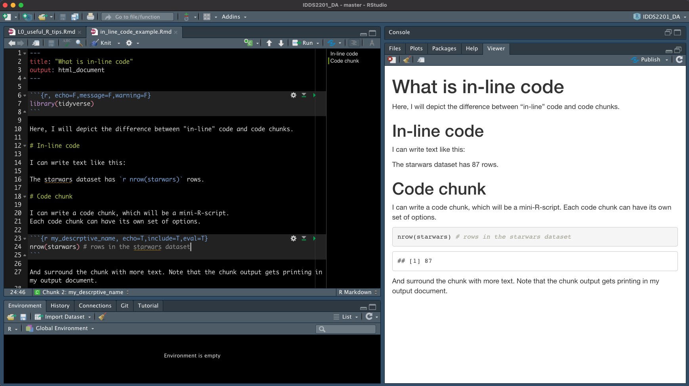

```{r child = "../setup.Rmd"}
```


```{r,echo=F, warning=F}
library(tidyverse)
```

# The R environment and R objects 

When you `assign` an object to a data structure in R, you store the object in the R environment.

```{r}
my_object <- 3
```

--

We can check what the object looks like by typing it into the console and pressing enter...

```{r}
my_object
```

--

... or by inspecting the object in the environment tab in RStudio

```{r, echo=F,out.width="40%"}
knitr::include_graphics(path = "img/RStudio_env.png")
```

---


We can manipulate objects and use them in computation, but those analyses are 
stored for subsequent use **only if** they are assigned to an object themselves. More info [here](https://r4ds.had.co.nz/workflow-basics.html).

--

```{r}
my_object * 2
```

```{r}
my_object
```

--

```{r}
my_new_object <- my_object * 2 
```

```{r}
my_object
my_new_object
```

---

.question[Why does this code **not** do what we intend?]

```{r, error=T}
starwars %>%
  mutate(BMI = mass/height) %>%
  select(name, height, mass, BMI)

ggplot(data = starwars, aes(y=BMI, x = height)) + 
  geom_point()
```

---

**We never stored the work in our environment.**

Two possible solutions: 

.pull-left[
A direct pipe
```{r, warning=F}
starwars %>%
  mutate(BMI = mass/height) %>%
  select(name, height, mass, BMI) %>% #<<
  ggplot(aes(y = BMI, x = height)) + 
  geom_point()
```
]


.pull-right[
Saving a new object and plotting that
```{r, warning=F}
starwars_bmi <- starwars %>% #<<
  mutate(BMI = mass/height) %>%
  select(name, height, mass, BMI)
ggplot(data = starwars_bmi, aes(y = BMI, x = height)) + #<<
  geom_point()
```

]

---

# Dimensions of objects

## One value

```{r}
my_object
```

--

## Multiple values in a vector
```{r}
my_vector <- c("One","Two","Pineapple","Squirrel")
my_vector
```

---

# Dimensions of objects

## Multiple variables in a data frame

.pull-left[
```{r, warning=F,message=F}
my_data_frame <- 
  data.frame(var1 = my_vector, 
             var2 = c(1,2,8,17))
my_data_frame
```
]

.pull-right[
```{r, warning=F,message=F}
library(tidyverse)
my_data_frame <- 
  tibble(var1 = my_vector, 
         var2 = c(1,2,8,17))
my_data_frame
```
]


---

# Pulling data out of objects

There are many ways to extract data from an R object.

## Using `[ , ]` on an object with one value

```{r}
my_object[1] # pull out the first value in this object
```

```{r}
my_object[2] # pull out the second value in this object
```

---
# Pulling data out of objects

There are many ways to extract data from an R object.

## Using `[ , ]` on an object with many values

```{r}
my_vector[1] # pull out the first value in this object
```

```{r}
my_vector[3] # pull out the third value in this object
```

```{r}
my_vector[10] # pull out the tenth value in this object
```


---
# Pulling data out of objects

There are many ways to extract data from an R object.

## Using `[ , ]` on a dataframe

.pull-left[
```{r}
my_data_frame[1,] 
```
]

.pull-right[
```{r}
my_data_frame[,2]
```
]

.question[What is happening here?]
 
---

# Pulling data out of objects

There are many ways to extract data from an R object.

## Using `[ , ]` on a dataframe

For 2-dimensional objects, `[,]` operates as `[row,column]`

```{r}
my_data_frame[4,1] 
```
--
.question[Subsetting tibbles returns tibbles. What if we wanted to grab that single value 
as a single character object, not a tibble object?]

---
# Pulling data out of objects

There are many ways to extract data from an R object.

## Using `[ , ]` on a dataframe
 For 2-dimensional objects, `[,]` operates as `[row,column]`

```{r}
my_new_object <- my_data_frame[4,1] 
my_new_object
my_new_object$var1
```

---

# Pulling data out of objects

There are many ways to extract data from an R object.

## Using `$` on a `named` object. 

`$` pulls out the named variable. 
--

.pull-left-narrow[

```{r}
my_data_frame[1:2,]
names(my_data_frame)
```

]

--

.pull-right-wide[
```{r}
my_data_frame$var1
```
]

---

# Pulling data out of objects

There are many ways to extract data from an R object.

## `tidyverse` style: `pull()`


```{r}
my_data_frame %>% 
  pull(var1)
```

---

# Extracting data using logical operators


operator    | definition                   || operator     | definition
------------|------------------------------||--------------|----------------
`<`         | less than                    ||`x`&nbsp;&#124;&nbsp;`y`     | `x` OR `y` 
`<=`        |	less than or equal to        ||`is.na(x)`    | test if `x` is `NA`
`>`         | greater than                 ||`!is.na(x)`   | test if `x` is not `NA`
`>=`        |	greater than or equal to     ||`x %in% y`    | test if `x` is in `y`
`==`        |	exactly equal to             ||`!(x %in% y)` | test if `x` is not in `y`
`!=`        |	not equal to                 ||`!x`          | not `x`
`x & y`     | `x` AND `y`                  ||              |

---

# Extracting data using logical operators

```{r}
my_sequence <- 1:20
my_sequence
```
```{r, echo=F}
evens <- my_sequence[c(F,T)]
```

```{r}
evens
```

--


```{r}
evens %in% my_sequence
```

--


```{r}
my_sequence %in% evens
```

---

#Extracting data using logical operators

`R` extracts the `TRUE` values from the vector


```{r}
my_sequence %in% evens
```


```{r}
my_sequence[my_sequence %in% evens]
```


---

#Extracting data using logical operators

`R` extracts the `TRUE` values from the vector

```{r}
my_sequence %in% 3:8
```


```{r}
my_sequence[my_sequence %in% 3:8]
```

---

#Extracting data using logical operators

`R` extracts the `TRUE` values from the vector


```{r}
my_sequence < 10
```


```{r}
my_sequence[my_sequence < 10]
```


---


# Pulling data out of objects


.question[What am I doing here?]

.pull-left[
```{r}
my_data_frame
```
]

.pull-right[

```{r}
my_var1 <- my_data_frame %>% 
  arrange(desc(var2)) %>%
  pull(var1)

my_data_frame %>%
  filter(var1 %in% my_var1[1:3]) 
```
]

---

.pull-left[
```{r}
my_var1 <- my_data_frame %>% 
  arrange(desc(var2)) 
my_var1
my_var1 <- my_var1 %>% pull(var1)
my_var1
```
]


--


.pull-right[

```{r}
my_data_frame %>%
  filter(var1 %in% my_var1[1:3]) 
```
]


---

# In-line code vs. chunks

```{r in_line_code_image,out.width="90%", echo=F}

```


---

# Subsetting data for a plot

Let's say you want to remove our old friend Jabba from the star wars plot (sorry, Jabba)


.small[
```{r, warning=F,out.width = "40%",out.width="35%"}
# note that in this code chunk I feed star wars into ggplot, 
# and then I feed a subset of starwars into a specific geom_point call
# so that I just highlight Jabba's point. 
starwars %>%
  ggplot(aes(x=height,y=mass)) + 
  geom_point() + 
  geom_point(data = starwars %>% 
               filter(name == "Jabba Desilijic Tiure"), 
             size = 5, pch = 1, color = "pink", stroke = 3) + 
  geom_text(data = starwars %>% 
               filter(name == "Jabba Desilijic Tiure"), label="Jabba is here -->   ",
             size = 5,hjust=1) 
```
]

---

You can filter the dataset, and then feed it into ggplot: 

```{r, warning=F,out.width="50%"}

starwars %>% # take the starwars dataframe, and then
  filter(mass < 1000) %>% # Only keep observations with mass less than 1000, and then
  ggplot(aes(x=height,y=mass)) + # plot, mapping height to x and mass to y, and 
  geom_point() # represent our data as points. 

```

Since Jabba is not in this dataset, ggplot zooms into the remaining data. 

---


Or you can use the `coord_cartesian` function

```{r, warning=F, out.width="50%"}
starwars %>% # take the starwars dataframe, and then
  ggplot(aes(x=height,y=mass)) + # plot, mapping height to x and mass to y, and 
  geom_point() +  # represent our data as points, and
  coord_cartesian(ylim=c(0,1000)) # zoom into the data with y limits of 0 to 1000
```
Here, Jabba still exists in the data, and you are telling ggplot to zoom into a subset of the data. 
Notice the difference between the two plots.


---


# P.S. 


- FAQ page on [ECLearn](https://eclearn.emmanuel.edu/courses/3412420/pages/r-and-git-faqs)

```{r, echo=F,out.width="75%"}
knitr::include_graphics(path = "img/ECLearn_FAQ.png")
```


