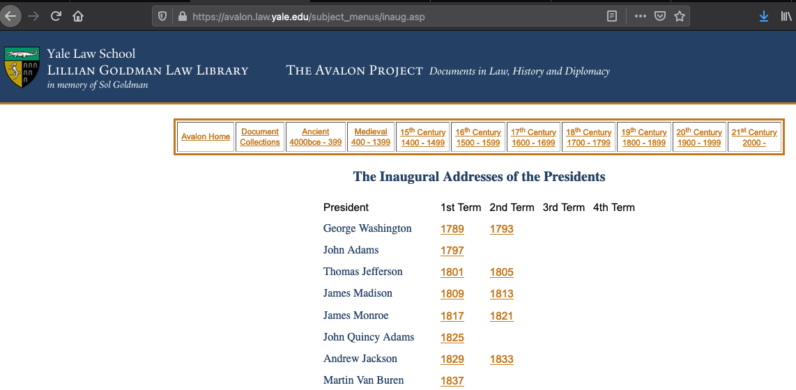
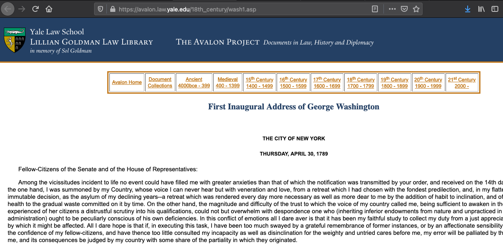
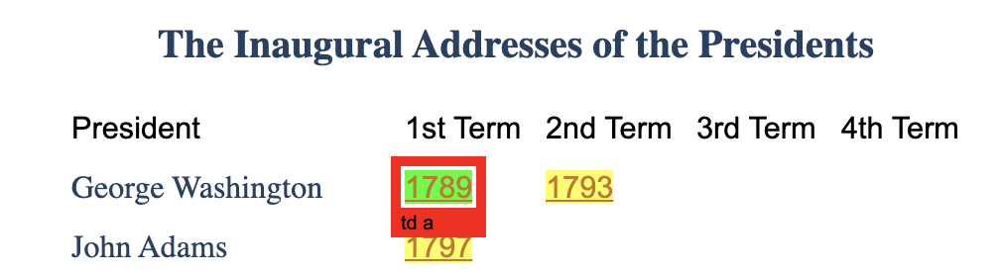
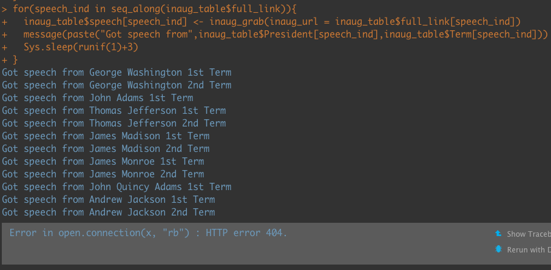
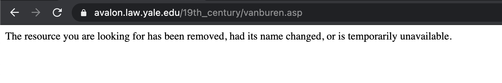

```{r child = "../setup.Rmd"}
```

```{r packages, echo = FALSE, message=FALSE, warning=FALSE}
library(tidyverse)
library(rvest)
```


class: middle

# Functions

---

## We have been using functions this whole time

```{r}
# This is a function
c(2,3,4)
```

--

```{r}
# so is this
mean(c(2,3,4))
```

--

```{r, out.width="25%"}
# and of course this 
ggplot()
```

---

## We can define our own functions! 

### Why would we want to do this? 

.can-edit[
- Good idea one
- Good idea two
]


---

class: middle

# Case study: Scraping all Presidential inaugural speeches

---

## 🏁 Start with

A [website with the inaugural addresses of the Presidents](https://avalon.law.yale.edu/subject_menus/inaug.asp)

.pull-left[
```{r, echo=F,out.width="110%"}

```
]

.pull-right[
```{r, echo=F,out.width="110%"}

```
]


---


## End with 🛑

```{r, echo=F}
final_inaug_table <- read_rds("data/inaug_table.RData")
```

```{r}
glimpse(final_inaug_table)
```


---


## Plan

1. Scrape main page table to get `President`, `Term`, `Year`, and `Link` to find all data necessary to find speeches. 

--

2. Scrape one of the speeches of one of the Presidents to make sure it is possible. 

--

3. Develop a function to do (2) automatically given URL. 

--

4. Iterate over all links from (1) in our function.

--

5. Join the data.

--

6. `r emo::ji("smile")`


---


## Scrape main page 

```{r, echo=F,out.width="110%"}

```

---

## Scrape main page

### Extracting a table, a useful trick

.small[
```{r}
library(rvest)
# remember to just load this in once
main_page <- read_html("https://avalon.law.yale.edu/subject_menus/inaug.asp")
```
]

--

.small[
```{r}
tables <- main_page %>%
  html_table() # extracts all tables it can find within the html page 

tables
```
]


---


## Scrape main page

### Fixing up our table

```{r}
# our table is the third element of the table list
inaug_table <- tables[[3]]

inaug_table
```


---

## Scrape main page

### Fixing up our table


```{r}
# the colnames of the name are in the first row
colnames(inaug_table) <- inaug_table[1,]

# now we can get rid of that first row
inaug_table <- inaug_table[-1,]

inaug_table
```


---

## Scrape main page

### Fixing up our table

Finally, we can make it `tidy`

```{r}
inaug_table <- inaug_table %>%
  pivot_longer(cols = -President, # cols with data are all except President
               names_to = "Term", # change names to "Term" 
               values_to = "Year") %>% # change values to "Year"
  filter(!is.na(Year))

inaug_table
```


---

## Scrape main page

We need to extract the links underlying the table data

```{r, echo=F,out.width="110%"}

```


---

## Scrape main page 

Using SelectorGadget (see previous lecture)

```{r, echo=F}

```


---

## Scrape main page

### `td a` contains all of the links and the years 

```{r}
td_a_elements <- main_page %>%
  html_elements("td a")

td_a_elements
```


---

## Scrape main page

### `td a` contains all of the links and the years 


```{r}
# get the dates
dates <- td_a_elements %>%
  html_text()
# get the links
refs <- td_a_elements %>%
  html_attr("href")
# make a table
elements_tib <- tibble(
  year = dates, 
  link = refs
)

elements_tib[12:15,]
```

---

## Scrape main page

### Joining it all together

What should we join by? 

.pull-left[
```{r}
inaug_table
```

]


.pull-right[
```{r}
elements_tib[12:15,]
```
]


---

## Scrape main page

### Joining it all together

```{r}
inaug_table <- left_join(x = inaug_table,
                         y = elements_tib, 
                         by = c("Year" = "year"))
inaug_table
```


---

## Scrape main page

### One last thing... 

We need to make the link a full link to the other sites

```{r}
inaug_table <- inaug_table %>%
  mutate(link = str_remove(string = link, pattern = "../")) %>%
  mutate(full_link = 
           paste("https://avalon.law.yale.edu/",link,sep=""))
inaug_table
```


---

## Plan

1. `r emo::ji("check")` Scrape main page table to get `President`, `Term`, `Year`, and `Link` to find all data necessary to find speeches. 

2. Scrape one of the speeches of one of the Presidents to make sure it is possible. 

3. Develop a function to do (2) automatically given URL. 

4. Iterate over all links from (1) in our function.

5. Join the data.

6. `r emo::ji("smile")`


---

## Grab a speech 

```{r}
inaug_address <- read_html("https://avalon.law.yale.edu/18th_century/wash1.asp")
```

What is the html element that gives us the text of the address? 

```{r, out.width="45%", echo=F}

```


---

# Grab a speech 

```{r}
inaug_text <- inaug_address %>%
  html_elements("p") %>%
  html_text()
inaug_text
```

--

```{r}
inaug_text <- paste(inaug_text, collapse = "")
inaug_text
```

---

## Plan

1. `r emo::ji("check")` Scrape main page table to get `President`, `Term`, `Year`, and `Link` to find all data necessary to find speeches. 

2. `r emo::ji("check")` Scrape one of the speeches of one of the Presidents to make sure it is possible. 

3. Develop a function to do (2) automatically given URL. 

4. Iterate over all links from (1) in our function.

5. Join the data.

6. `r emo::ji("smile")`


---

## Wait... 

How many times do I need to copy and paste all this code?

```{r, echo=F}

```

--

Ugh... 


---

# Functions

.question[
When should I create my own function? 
]

--

When you’ve copied and pasted a block of code more than twice.

---

## Why functions?

- Automate common tasks in a more powerful and general way than copy-and-pasting:
- Give your function an evocative name that makes your code easier to understand
- As requirements change, only need to update code in one place, instead of many
- Eliminate chance of making incidental mistakes when you copy and paste (i.e. updating a variable name in one place, but not in another)

--

- Down the line: Improve your reach as a data scientist by writing functions (and packages!) that others use

---


.question[
Assuming that the page structure is the same for each speech page, how many "things" do you need to know for each speech page to scrape the data we want from it? 
]


```{r, eval=F}

inaug_address <- read_html("https://avalon.law.yale.edu/18th_century/wash1.asp")

inaug_text <- inaug_address %>%
  html_elements("p") %>%
  html_text()

inaug_text <- paste(inaug_text, collapse = "")

```


---

## Turning your code into a function


- Pick a short but informative **name**, preferably a verb.

<br>
<br>
<br>
<br>

```{r eval=FALSE}
scrape_speech <- 
  
  
  
  
  
  
```


---


## Turn your code into a function

- Pick a short but informative **name**, preferably a verb.
- List inputs, or **arguments**, to the function inside `function`. If we had more the call would look like `function(x, y, z)`.

<br>

```{r eval=FALSE}
scrape_speech <- function(x){


}  
```

---

## Turn your code into a function

- Pick a short but informative **name**, preferably a verb.
- List inputs, or **arguments**, to the function inside `function`. If we had more the call would look like `function(x, y, z)`.
- Place the **code** you have developed in body of the function, a `{` block that immediately follows `function(...)`.

```{r eval=FALSE}
scrape_speech <- function(url){
  
  # code we developed earlier to scrape info 
  # on single art piece goes here
  
}
```


---

## Turn your code into a function

```{r}
scrape_speech <- function(url){
  
  inaug_address <- read_html(url) #<<
  
  inaug_text <- inaug_address %>%
    html_elements("p") %>%
    html_text()
  
  inaug_text <- paste(inaug_text, collapse = "")
  
  return(inaug_text) #<<
  
}
```

Functions are their own environments... only returns what you tell it to! 


---

## Testing our function

```{r}
scrape_speech(url = "https://avalon.law.yale.edu/18th_century/wash1.asp")
Sys.sleep(1) # sleep for one second
scrape_speech(url = "https://avalon.law.yale.edu/20th_century/kennedy.asp")
```

---


## Plan

1. `r emo::ji("check")` Scrape main page table to get `President`, `Term`, `Year`, and `Link` to find all data necessary to find speeches. 

2. `r emo::ji("check")` Scrape one of the speeches of one of the Presidents to make sure it is possible. 

3. `r emo::ji("check")` Develop a function to do (2) automatically given URL. 

4. Iterate over all links from (1) in our function.

5. Join the data.

6. `r emo::ji("smile")`


---


class: middle

# Brief aside: Writing functions

---

## What goes in / what comes out?

.pull-left-wide[
- They take input(s) defined in the function definition

```{r eval=FALSE}
function([inputs separated by commas]){
  # what to do with those inputs
}
```

- By default they return the last value computed in the function

```{r eval=FALSE}
scrape_page <- function(x){
  # do bunch of stuff with the input...
  
  # return a tibble
  tibble(...)
}
```

- You can define more outputs to be returned in a list as well as nice print methods (but we won't go there for now...)
]

---

.question[
What is going on here?
]

```{r}
add_2 <- function(x){
  x + 2
  1000
}
```

```{r}
add_2(3)
add_2(10)
```

---

## Naming functions

> "There are only two hard things in Computer Science: cache invalidation and naming things." - Phil Karlton

---

## Naming functions

- Names should be short but clearly evoke what the function does

--
- Names should be verbs, not nouns

--
- Multi-word names should be separated by underscores (`snake_case` as opposed to `camelCase`)

--
- A family of functions should be named similarly (`scrape_page()`, `scrape_speech()` OR `str_remove()`, `str_replace()` etc.)

--
- Avoid overwriting existing (especially widely used) functions

```{r eval=FALSE}
# NEVER DO THIS
mean <- function(x){ 
  x * 3 
  }
```


---

class: middle

# Iteration

---


## Define the task


- Goal: Scrape all speeches from all Presidents.
- Like this: 

```{r, eval=F}
speech1 <- scrape_speech(url[1])
speech2 <- scrape_speech(url[2])
speech3 <- scrape_speech(url[3])
...
speech55 <- scrape_speech(url[55])
```

--

- There must be a better way! 


---

background-image: url("img/monster_for_loop.png")
background-size: contain

---


## Using a for loop


```{r}
inaug_table$speech <- NA # create an empty variable to hold the speeches

seq_along(inaug_table$full_link) # creates a sequence of numbers for the length of the object
```

--

```{r, eval=F}
for(speech_ind in seq_along(inaug_table$full_link)){
  inaug_table$speech[speech_ind] <- scrape_speech(url = inaug_table$full_link[speech_ind])
  message(paste("Got speech from",
                inaug_table$President[speech_ind],
                inaug_table$Term[speech_ind])) # tell me where you are
  Sys.sleep(runif(1)+3) # sleep a random bit
}
```

--
What could go wrong? 


---


```{r,echo=F, out.width="80%"}

```


--


```{r, echo=F, out.width="80%"}

```


---


## Catching errors

Not going to dive into this, but be aware of it in case it is useful, and you can search online for how to implement given your specific solution. 

```{r}
scrape_speech<- function(url){
  
  
  inaug_address <- tryCatch( #<<
    read_html(url),
    error = function(cond){NA}) # if error, return NA
  
  # if there was the error, return NA from the main function
  if(is.na(inaug_address)){
    return(NA)
  }
  
  inaug_text <- inaug_address %>%
    html_elements("p") %>%
    html_text()
  
  inaug_text <- paste(inaug_text, collapse = "")
  
  # if no error, return the text as usual. 
  return(inaug_text) 
  
}
```


---

```{r, eval = F}
for(speech_ind in seq_along(inaug_table$full_link)){
  inaug_table$speech[speech_ind] <- scrape_speech(url = inaug_table$full_link[speech_ind])
  message(paste("Got speech from",inaug_table$President[speech_ind],inaug_table$Term[speech_ind]))
  Sys.sleep(runif(1)+3)
}
```


```{r, echo=F}
inaug_table <- final_inaug_table
```

--

```{r}
inaug_table
```


---

## Plan

1. `r emo::ji("check")` Scrape main page table to get `President`, `Term`, `Year`, and `Link` to find all data necessary to find speeches. 

2. `r emo::ji("check")` Scrape one of the speeches of one of the Presidents to make sure it is possible. 

3. `r emo::ji("check")` Develop a function to do (2) automatically given URL. 

4. `r emo::ji("check")` Iterate over all links from (1) in our function.

5. `r emo::ji("check")` Join the data.

6. `r emo::ji("smile")`


---

```{r}
library(tidytext)
data(stop_words)

inaug_table %>%
  select(President,Term,speech) %>%
  unnest_tokens(word, speech) %>%
  anti_join(stop_words) %>%
  group_by(President, Term) %>%
  summarize(total_words = n()) %>%
  arrange(desc(total_words)) -> 
  inaug_length

inaug_length
```


---

.small[
```{r, out.width="72%"}
inaug_length <- inaug_length %>%
  filter(total_words > 1) 

inaug_length$President <- factor(inaug_length$President, levels=rev(unique(inaug_length$President)))

ggplot(inaug_length) + 
  geom_col(aes(y=President, x=total_words, fill=Term), position="dodge") + 
  theme_minimal()
```
]


---

```{r, eval=F}
inaug_table$speech[2]
```


[1] "Fellow Citizens:  I am again called upon by the voice of my country to execute the functions of its Chief Magistrate. When the occasion proper for it shall arrive, I shall endeavor to express the high sense I entertain of this distinguished honor, and of the confidence which has been reposed in me by the people of united America.  Previous to the execution of any official act of the President the Constitution requires an oath of office. This oath I am now about to take, and in your presence: That if it shall be found during my administration of the Government I have in any instance violated willingly or knowingly the injunctions thereof, I may (besides incurring constitutional punishment) be subject to the upbraidings of all who are now witnesses of the present solemn ceremony. "


---

## Using the `map` family of functions

```{r, eval=F}
# wow much simpler... 
all_speeches <- map(inaug_table$full_link, scrape_speech)
```


```{r,include=F,eval=F}
# ran once, do not want to rerun each knit
all_speeches <- map(inaug_table$full_link, scrape_speech)
saveRDS(all_speeches, file = "data/all_speeches.RData")
```


```{r, include=FALSE}
all_speeches <- readRDS(file = "data/all_speeches.RData")
```


```{r}
glimpse(all_speeches)
```


---


## How does mapping work?

Suppose we have exam 1 and exam 2 scores of 4 students stored in a list...

```{r}
exam_scores <- list(
  exam1 <- c(80, 90, 70, 50),
  exam2 <- c(85, 83, 45, 60)
)
```

--

...and we find the mean score in each exam

```{r}
map(exam_scores, mean)
```

---

...and suppose we want the results as a numeric (double) vector

```{r}
map_dbl(exam_scores, mean)
```

...or as a character string

```{r}
map_chr(exam_scores, mean)
```

---

## `map_something`

Functions for looping over an object and returning a value (of a specific type):

* `map()` - returns a list
* `map_lgl()` - returns a logical vector
* `map_int()` - returns a integer vector
* `map_dbl()` - returns a double vector
* `map_chr()` - returns a character vector
* `map_df()` / `map_dfr()` - returns a data frame by row binding
* `map_dfc()` - returns a data frame by column binding
* ...

---

## Need to add the speeches to our data frame.
### Turning the speeches into a data frame

.pull-left[
```{r}
# enframe turns a list into a data frame
all_speeches_df <- all_speeches %>% 
  enframe(value = "speech")
all_speeches_df
```
]

--

.pull-right[
```{r}
# unnest explodes each list element 
# just one per row here, so retains 
# original number of rows.
all_speeches_df <- all_speeches_df %>%
  unnest(speech) 
all_speeches_df
```
]


---

## Need to add the speeches to our data frame.
### Adding the speeches as a column 

```{r}
inaug_table <- inaug_table %>%
  mutate(speech = all_speeches_df$speech)

glimpse(inaug_table)
```


---


# Attributions

Some of the material in this slide deck was inspired by and/or partially adapted from several open-source data science resources, including

- The [datasciencebox](https://github.com/rstudio-education/datascience-box) by Mine Çetinkaya-Rundel [CC BY-SA 4.0](https://creativecommons.org/licenses/by-sa/4.0/) 
- The [R for Data Science](https://r4ds.had.co.nz/) textbook by Hadley Wickham & Garrett Grolemund [CC BY-NC-ND 3.0 US](https://creativecommons.org/licenses/by-nc-nd/3.0/us/) 
- Artwork by @allison_horst [CC BY-SA 4.1](https://creativecommons.org/licenses/by-sa/4.0/) 


