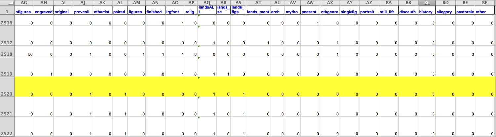

```{r child = "../setup.Rmd"}
```


```{r packages, echo = FALSE, message=FALSE, warning=FALSE}
library(tidyverse)
library(tidymodels)
library(ggtext)
library(knitr)
library(kableExtra)
set.seed(1234)
options(dplyr.print_min = 10, dplyr.print_max = 6)
```


class: middle

# The language of models

---

## Modeling

- Use models to explain the relationship between variables and to make predictions
- For now we will focus on **linear** models (but remember there are *many* *many* other types of models too!)

.pull-left[
```{r echo = FALSE, out.width = "100%"}
df1 <- tibble(x = 1:100, y = x + rnorm(100, mean = 0, sd = 5))
ggplot(df1, aes(x = x, y = y)) +
  geom_point() +
  geom_smooth(method = "lm", color = "#E48957", se = FALSE) +
  labs(title = "Linear", x = NULL, y = NULL) +
  theme(
    axis.text  = element_blank(),
    axis.ticks = element_blank()
    )
```
]
.pull-right[
```{r echo = FALSE, out.width = "100%"}
df2 <- tibble(x = seq(-6, 5.9, 0.1), y = (1 / (1+exp(-2*x))) + rnorm(120, mean = 0, sd = 0.1))
ggplot(df2, aes(x = x, y = y)) +
  geom_point() +
  geom_smooth(method = "loess", color = "#8E2C90", se = FALSE) +
  labs(title = "Non-linear", x = NULL, y = NULL) +
  theme(
    axis.text  = element_blank(),
    axis.ticks = element_blank()
    )
```
]

---
class: middle

# Data: Paris Paintings

---

## Paris Paintings

```{r message=FALSE}
pp <- read_csv("data/paris-paintings.csv", na = c("n/a", "", "NA"))
```

- Source: Printed catalogs of 28 auction sales in Paris, 1764 - 1780
- Data curators Sandra van Ginhoven and Hilary Coe Cronheim (who were PhD students in the Duke Art, Law, and Markets Initiative at the time of putting together this dataset) translated and tabulated the catalogs
- `r nrow(pp)` paintings, their prices, and descriptive details from sales catalogs over 60 variables

---

## Auctions today

```{r out.width="65%", echo=FALSE}

```

---

## Auctions back in the day

```{r out.width="65%", echo=FALSE}
knitr::include_graphics("img/old-auction.png")
```

.footnote[
.small[
Pierre-Antoine de Machy, Public Sale at the Hôtel Bullion, Musée Carnavalet, Paris (18th century)
]
]

---

## Paris auction market

```{r out.width="60%", echo=FALSE}
knitr::include_graphics("img/auction-trend-paris.png")
```

.footnote[
.small[
Plot credit: Sandra van Ginhoven
]
]

---

background-image: url("img/depart-pour-la-chasse.png")
background-size: contain

## Départ pour la chasse


---

## Auction catalog text

.pull-left[
```{r out.width="60%", echo=FALSE}
knitr::include_graphics("img/auction-catalogue.png")
```
]
.pull-right[
.small[
Two paintings very rich in composition, of a beautiful execution, and whose merit is very remarkable, each 17 inches 3 lines high, 23 inches wide; the first, painted on wood, comes from the Cabinet of Madame la Comtesse de Verrue; it represents a departure for the hunt: it shows in the front a child on a white horse, a man who gives the horn to gather the dogs, a falconer and other figures nicely distributed across the width of the painting; two horses drinking from a fountain; on the right in the corner a lovely country house topped by a terrace, on which people are at the table, others who play instruments; trees and fabriques pleasantly enrich the background.
]
]

---

```{r out.width="60%", echo=FALSE}
knitr::include_graphics("img/painting1.png")
knitr::include_graphics("img/painting2.png")

```

---

```{r results="hide"}
pp %>%
  filter(name == "R1777-89a") %>%
  glimpse()
```

.small[
.pull-left[
```{r output.lines=23, echo=FALSE}
pp %>%
  filter(name == "R1777-89a") %>%
  glimpse()
```
]
.pull-right[
```{r output.lines=24:44, echo=FALSE}
pp %>%
  filter(name == "R1777-89a") %>%
  glimpse()
```
]
]


---

class: middle

# Modeling the relationship between variables

---

## Heights

.small[
```{r height-dist, out.width="60%", warning=FALSE}
ggplot(data = pp, aes(x = Height_in)) +
  geom_histogram(binwidth = 5) +
  labs(x = "Height, in inches", y = NULL)
```
]

---

## Widths

.small[
```{r width-dist, out.width="60%", warning=FALSE}
ggplot(data = pp, aes(x = Width_in)) +
  geom_histogram(binwidth = 5) +
  labs(x = "Width, in inches", y = NULL)
```
]

---

## Models as functions

- We can represent relationships between variables using **functions**
- A function is a mathematical concept: the relationship between an output and one or more inputs
  - Plug in the inputs and receive back the output
  - Example: The formula $y = 3x + 7$ is a function with input $x$ and output $y$. If $x$ is $5$, $y$ is $22$, $y = 3 \times 5 + 7 = 22$

---

## Height as a function of width

.panelset[
.panel[.panel-name[Plot]
```{r ref.label = "height-width-plot", echo = FALSE, warning = FALSE, out.width = "60%"}
```
]
.panel[.panel-name[Code]

```{r height-width-plot, fig.show="hide"}
ggplot(data = pp, aes(x = Width_in, y = Height_in)) +
  geom_point() +
  geom_smooth(method = "lm") +
  labs(
    title = "Height vs. width of paintings",
    subtitle = "Paris auctions, 1764 - 1780",
    x = "Width (inches)",
    y = "Height (inches)"
  ) + 
  theme_bw()
```
]
]

---

## ... without the measure of uncertainty

.panelset[
.panel[.panel-name[Plot]
```{r ref.label = "height-width-plot-no-se", echo = FALSE, warning = FALSE, out.width = "60%"}
```
]
.panel[.panel-name[Code]

```{r height-width-plot-no-se, fig.show="hide", warning=FALSE}
ggplot(data = pp, aes(x = Width_in, y = Height_in)) +
  geom_point() +
  geom_smooth(method = "lm", 
              se = FALSE) + #<<
  labs(
    title = "Height vs. width of paintings",
    subtitle = "Paris auctions, 1764 - 1780",
    x = "Width (inches)",
    y = "Height (inches)"
  ) + 
  theme_bw()
```
]
]

---

## ... with different cosmetic choices

.panelset[
.panel[.panel-name[Plot]
```{r ref.label = "height-width-plot-cosmetics", echo = FALSE, warning = FALSE, out.width = "60%"}
```
]
.panel[.panel-name[Code]

```{r height-width-plot-cosmetics, fig.show="hide", warning=FALSE}
ggplot(data = pp, aes(x = Width_in, y = Height_in)) +
  geom_point() +
  geom_smooth(method = "lm", se = FALSE,
              color = "#8E2C90", linetype = "dashed", size = 3) + #<<
  labs(
    title = "Height vs. width of paintings",
    subtitle = "Paris auctions, 1764 - 1780",
    x = "Width (inches)",
    y = "Height (inches)"
  ) + 
  theme_bw()
```
]
]

---

## Other smoothing methods: gam

.panelset[
.panel[.panel-name[Plot]
```{r ref.label = "height-width-plot-gam", echo = FALSE, warning = FALSE, out.width = "60%"}
```
]
.panel[.panel-name[Code]

```{r height-width-plot-gam, fig.show="hide", warning=FALSE}
ggplot(data = pp, aes(x = Width_in, y = Height_in)) +
  geom_point() +
  geom_smooth(method = "gam", #<<
              se = FALSE, color = "#8E2C90") + 
  labs(
    title = "Height vs. width of paintings",
    subtitle = "Paris auctions, 1764 - 1780",
    x = "Width (inches)",
    y = "Height (inches)"
  ) + 
  theme_bw()
```
]
]


???
Generalized additive model. 

---

## Other smoothing methods: loess

.panelset[
.panel[.panel-name[Plot]
```{r ref.label = "height-width-plot-loess", echo = FALSE, warning = FALSE, out.width = "60%"}
```
]
.panel[.panel-name[Code]

```{r height-width-plot-loess, fig.show="hide", warning=FALSE}
ggplot(data = pp, aes(x = Width_in, y = Height_in)) +
  geom_point() +
  geom_smooth(method = "loess", #<<
              se = FALSE, color = "#8E2C90") + 
  labs(
    title = "Height vs. width of paintings",
    subtitle = "Paris auctions, 1764 - 1780",
    x = "Width (inches)",
    y = "Height (inches)"
  ) + 
  theme_bw()
```
]
]

---

## Vocabulary

- **Response variable:** Variable whose behavior or variation you are trying to understand, on the y-axis

--
- **Explanatory variables:** Other variables that you want to use to explain the variation in the response, on the x-axis

--
- **Predicted value:** Output of the **model function**
  - The model function gives the typical (expected) value of the response variable *conditioning* on the explanatory variables
  
--
- **Residuals:** A measure of how far each case is from its predicted value (based on a particular model)
  - Residual = Observed value - Predicted value
  - Tells how far above/below the expected value each case is

---

## Residuals

.panelset[
.panel[.panel-name[Plot]
```{r ref.label = "height-width-plot-residuals", echo = FALSE, warning = FALSE, out.width = "60%"}
```
]
.panel[.panel-name[Code]
.small[
```{r height-width-plot-residuals, fig.show="hide", warning=FALSE}
ht_wt_fit <- linear_reg() %>%
  set_engine("lm") %>%
  fit(Height_in ~ Width_in, data = pp)

ht_wt_fit_tidy <- tidy(ht_wt_fit$fit) 
ht_wt_fit_aug  <- augment(ht_wt_fit$fit) %>%
  mutate(res_cat = ifelse(.resid > 0, TRUE, FALSE))

ggplot(data = ht_wt_fit_aug) +
  geom_point(aes(x = Width_in, y = Height_in, color = res_cat)) +
  geom_line(aes(x = Width_in, y = .fitted), size = 0.75, color = "#8E2C90") + 
  labs(
    title = "Height vs. width of paintings",
    subtitle = "Paris auctions, 1764 - 1780",
    x = "Width (inches)",
    y = "Height (inches)"
  ) +
  guides(color = FALSE) +
  scale_color_manual(values = c("#260b27", "#e6b0e7")) +
  geom_text(aes(x = 0, y = 150), label = "Positive residual", color = "#e6b0e7", hjust = 0, size = 8) +
  geom_text(aes(x = 100, y = 15), label = "Negative residual", color = "#260b27", hjust = 0, size = 8) + 
  theme_bw()
```
]
]
]

---

.question[
The plot below displays the relationship between height and width of paintings. The only difference from the previous plots is that it uses a smaller alpha value, making the points somewhat transparent. What feature is apparent in this plot that was not (as) apparent in the previous plots? What might be the reason for this feature?
]

```{r height-width-plot-alpha, warning = FALSE, echo=FALSE, out.width="55%"}
ggplot(data = pp, aes(x = Width_in, y = Height_in)) +
  geom_point(alpha = 0.2) +
  labs(
    title = "Height vs. width of paintings",
    subtitle = "Paris auctions, 1764 - 1780",
    x = "Width (inches)",
    y = "Height (inches)"
  )+ 
  theme_bw()
```

---

## Landscape paintings

- Landscape painting is the depiction in art of landscapes – natural scenery such as mountains, valleys, trees, rivers, and forests, especially where the main subject is a wide view – with its elements arranged into a coherent
composition.<sup>1</sup>
  - Landscape paintings tend to be wider than they are long.
- Portrait painting is a genre in painting, where the intent is to depict a human subject.<sup>2</sup>
  - Portrait paintings tend to be longer than they are wide.

.footnote[
[1] Source: Wikipedia, [Landscape painting](https://en.wikipedia.org/wiki/Landscape_painting)

[2] Source: Wikipedia, [Portait painting](https://en.wikipedia.org/wiki/Portrait_painting)
]

---

## Multiple explanatory variables

.panelset[
.panel[.panel-name[Plot]
.pull-left-narrow[
.question[
How, if at all, does the relationship between width and height of paintings vary by whether or not they have any landscape elements?
]
]
.pull-right-wide[
```{r ref.label = "height-width-landscape", echo = FALSE, warning = FALSE, out.width = "80%"}
```
]
]
.panel[.panel-name[Code]
```{r height-width-landscape, fig.show="hide", warning=FALSE}
ggplot(data = pp, aes(x = Width_in, y = Height_in, color = factor(landsALL))) +
  geom_point(alpha = 0.4) +
  geom_smooth(method = "lm", se = FALSE) +
  labs(
    title = "Height vs. width of paintings, by landscape features",
    subtitle = "Paris auctions, 1764 - 1780",
    x = "Width (inches)",
    y = "Height (inches)",
    color = "landscape"
  ) +
  scale_color_manual(values = c("#E48957", "#071381")) + 
  theme_bw()
```
]
]

---

## Extending regression lines

.panelset[
.panel[.panel-name[Plot]
```{r ref.label = "extrapolation", echo = FALSE, warning = FALSE, out.width = "65%"}
```
]
.panel[.panel-name[Code]
```{r extrapolation, fig.show="hide", warning=FALSE}
ggplot(data = pp, aes(x = Width_in, y = Height_in, color = factor(landsALL))) +
  geom_point(alpha = 0.4) +
  geom_smooth(method = "lm", se = FALSE,
              fullrange = TRUE) + #<<
  labs(
    title = "Height vs. width of paintings, by landscape features",
    subtitle = "Paris auctions, 1764 - 1780",
    x = "Width (inches)",
    y = "Height (inches)",
    color = "landscape"
  ) +
  scale_color_manual(values = c("#E48957", "#071381")) + 
  theme_bw()
```
]
]

---

## Models - upsides and downsides

- Models can sometimes reveal patterns that are not evident in a graph of the data. This is a great advantage of modeling over simple visual inspection of data. 
- There is a real risk, however, that a model is imposing structure that is not really there on the scatter of data, just as people imagine animal shapes in the stars. A skeptical approach is always warranted.

---

## Variation around the model...

is just as important as the model, if not more!  

*Statistics is the explanation of variation in the context of what remains unexplained.*

- The scatter suggests that there might be other factors that account for large parts of painting-to-painting variability, or perhaps just that randomness plays a big role.
- Adding more explanatory variables to a model can sometimes usefully reduce the size of the scatter around the model. (We'll talk more about this later.)

---

## How do we use models?

- Explanation: Characterize the relationship between $y$ and $x$ via *slopes* for numerical explanatory variables or *differences* for categorical explanatory variables
- Prediction: Plug in $x$, get the predicted $y$


---

class: middle

# Fitting and interpreting models

---


class: middle

# Models with numerical explanatory variables

---

## Data: Paris Paintings

```{r message=FALSE}
pp <- read_csv("data/paris-paintings.csv", na = c("n/a", "", "NA"))
```

- Number of observations: `r nrow(pp)`
- Number of variables: `r ncol(pp)`

---

## Goal: Predict height from width

$$\widehat{height}_{i} = \beta_0 + \beta_1 \times width_{i}$$

```{r height-width-plot2, echo=FALSE, warning=FALSE}
ggplot(data = pp, aes(x = Width_in, y = Height_in)) +
  geom_point() +
  geom_smooth(method = "lm", se = FALSE, color = "#8E2C90") + 
  labs(
    title = "Height vs. width of paintings",
    subtitle = "Paris auctions, 1764 - 1780",
    x = "Width (inches)",
    y = "Height (inches)"
  ) + theme_bw()
```


---

```{r out.width="98%", echo=FALSE}
knitr::include_graphics("img/tidymodels.png")
```

---

## Step 1: Specify model

```{r}
linear_reg()
```

---

## Step 2: Set model fitting *engine*

```{r}
linear_reg() %>%
  set_engine("lm") # lm: linear model
```


---

background-image: url("img/parsnip.png")
background-size: contain


---

## Step 3: Fit model & estimate parameters

... using **formula syntax**

```{r fit-model}
linear_reg() %>%
  set_engine("lm") %>%
  fit(Height_in ~ Width_in, data = pp)
```

---

## A closer look at model output

```{r ref.label="fit-model", echo=FALSE}
```

.large[
$$\widehat{height}_{i} = 3.6214 + 0.7808 \times width_{i}$$
]

---

## A tidy look at model output

```{r}
linear_reg() %>%
  set_engine("lm") %>%
  fit(Height_in ~ Width_in, data = pp) %>%
  tidy()
```

.large[
$$\widehat{height}_{i} = 3.62 + 0.781 \times width_{i}$$
]

---

## Slope and intercept

.large[
$$\widehat{height}_{i} = 3.62 + 0.781 \times width_{i}$$
]

--

- **Slope:** For each additional inch the painting is wider, the height is expected to be higher, on average, by 0.781 inches.

--
- **Intercept:** Paintings that are 0 inches wide are expected to be 3.62 inches high, on average. (Does this make sense?)

---

## Correlation does not imply causation

Remember this when interpreting model coefficients

```{r echo=FALSE, out.width="90%"}

```

.footnote[
Source: XKCD, [Cell phones](https://xkcd.com/925/)
]

---

class: middle

# Parameter estimation

---

## Linear model with a single predictor

- We're interested in $\beta_0$ (population parameter for the intercept) and $\beta_1$ (population parameter for the slope) in the following model:

$$\hat{y}_{i} = \beta_0 + \beta_1~x_{i}$$

--
- Tough luck, you can't have them...

--
- So we use sample statistics to estimate them:

$$\hat{y}_{i} = b_0 + b_1~x_{i}$$


???
This is why we calculate and report the uncertainty around parameter estimates. 

---

## Least squares regression

- The regression line minimizes the sum of squared residuals.

--
- If $e_i = y_i - \hat{y}_i$, then, the regression line minimizes 
$\sum_{i = 1}^n e_i^2$.


???
Why square error? We have negative residuals, want to minimize their distance from the fit. Also, we want to weigh further away residuals more. 

---

## Visualizing residuals

```{r vis-res-1, echo=FALSE, out.width="70%"}
ht_wt_fit <- linear_reg() %>%
  set_engine("lm") %>%
  fit(Height_in ~ Width_in, data = pp)

ht_wt_fit_tidy <- tidy(ht_wt_fit$fit) 
ht_wt_fit_aug  <- augment(ht_wt_fit$fit) %>%
  mutate(res_cat = ifelse(.resid > 0, TRUE, FALSE))

p <- ggplot(data = ht_wt_fit_aug, 
            aes(x = Width_in, y = Height_in)) +
  geom_point(alpha = 0.2) + 
  labs(
    title = "Height vs. width of paintings",
    subtitle = "Just the data",
    x = "Width (inches)",
    y = "Height (inches)"
    ) +
  coord_cartesian(xlim = c(0, 250), ylim = c(0, 200)) +
  theme_bw() + 
  theme(plot.subtitle = element_text(color = "#E48957", face = "bold", size = rel(1.5)))
p
```

---

## Visualizing residuals (cont.)

```{r vis-res-2, echo=FALSE, out.width="70%"}
p <- p + 
  geom_smooth(method = "lm", color = "#8E2C90", se = FALSE) +
  geom_point(mapping = aes(y = .fitted), color = "#E48957") +
  labs(subtitle = "Data + least squares line") 
p
```

---

## Visualizing residuals (cont.)

```{r vis-res-3, echo = FALSE, out.width="70%"}
p + 
  geom_segment(mapping = aes(xend = Width_in, yend = .fitted), color = "#E48957", alpha = 0.4) +
  labs(subtitle = "Data + least squares line + residuals")
```

---

## Properties of least squares regression

- The regression line goes through the center of mass point, the coordinates corresponding to average $x$ and average $y$, $(\bar{x}, \bar{y})$:  

$$\bar{y} = b_0 + b_1 \bar{x} ~ \rightarrow ~ b_0 = \bar{y} - b_1 \bar{x}$$

--
- The slope has the same sign as the correlation coefficient: $b_1 = r \frac{s_y}{s_x}$

--
- The sum of the residuals is zero: $\sum_{i = 1}^n e_i = 0$

--
- The residuals and $x$ values are uncorrelated

---

class: middle

# Models with categorical explanatory variables

---

## Categorical predictor with 2 levels

.pull-left-narrow[
.small[
```{r echo=FALSE}
pp %>% 
  select(name, Height_in, landsALL) %>%
  print(n = 20)
```
]
]
.pull-right-wide[
- `landsALL = 0`: No landscape features
- `landsALL = 1`: Some landscape features
]

---

## Height & landscape features

```{r ht-lands-fit}
linear_reg() %>%
  set_engine("lm") %>%
  fit(Height_in ~ factor(landsALL), data = pp) %>%
  tidy()
```

---

## Height & landscape features

$$\widehat{Height_{in}} = 22.7 - 5.645~landsALL$$

- **Slope:** Paintings with landscape features are expected, on average, to be 5.645 inches shorter than paintings that without landscape features
  - Compares baseline level (`landsALL = 0`) to the other level (`landsALL = 1`)
    
- **Intercept:** Paintings that don't have landscape features are expected, on average, to be 22.7 inches tall

---

## Relationship between height and school


```{r}
glimpse(pp$school_pntg)
```


---

## Relationship between height and school

```{r ht-school}
linear_reg() %>%
  set_engine("lm") %>%
  fit(Height_in ~ school_pntg, data = pp) %>%
  tidy()
```

---

## binary variables

```{r ref.label="ht-school", echo = FALSE}
```

- When the categorical explanatory variable has many levels, they're encoded to **binary variables**
- Each coefficient describes the expected difference between heights in that particular school compared to the baseline level

---

## Categorical predictor with 3+ levels

.pull-left-wide[
```{r echo=FALSE}
binary_df <- pp %>% 
  select(school_pntg) %>% 
  group_by(school_pntg) %>% 
  sample_n(1) %>%
  mutate(
    D_FL = as.integer(ifelse(school_pntg == "D/FL", 1L, 0)),
    F    = as.integer(ifelse(school_pntg == "F", 1L, 0)),
    G    = as.integer(ifelse(school_pntg == "G", 1L, 0)),
    I    = as.integer(ifelse(school_pntg == "I", 1L, 0)),
    S    = as.integer(ifelse(school_pntg == "S", 1L, 0)),
    X    = as.integer(ifelse(school_pntg == "X", 1L, 0))
  )

binary_df %>%
  kable(align = "lcccccc") %>%
  kable_styling() %>%
  column_spec(2, width = "10em", background = spec_color(binary_df$D_FL[1:7], end = 0.8), color = "white") %>%
  column_spec(3, width = "10em", background = spec_color(binary_df$F[1:7], end = 0.8), color = "white") %>%
  column_spec(4, width = "10em", background = spec_color(binary_df$G[1:7], end = 0.8), color = "white") %>%
  column_spec(5, width = "10em", background = spec_color(binary_df$I[1:7], end = 0.8), color = "white") %>%
  column_spec(6, width = "10em", background = spec_color(binary_df$S[1:7], end = 0.8), color = "white") %>%
  column_spec(7, width = "10em", background = spec_color(binary_df$X[1:7], end = 0.8), color = "white")
```
]
.pull-right-narrow[
.small[
```{r echo=FALSE}
pp %>% 
  select(name, Height_in, school_pntg) %>%
  print(n = 20)
```
]
]

---

## Relationship between height and school

.small[
```{r ref.label="ht-school", echo=FALSE}
```

- **Austrian school (A)** paintings are expected, on average, to be **14 inches** tall.
- **Dutch/Flemish school (D/FL)** paintings are expected, on average, to be **2.33 inches taller** than *Austrian school* paintings.
- **French school (F)** paintings are expected, on average, to be **10.2 inches taller** than *Austrian school* paintings.
- **German school (G)** paintings are expected, on average, to be **1.65 inches taller** than *Austrian school* paintings.
- **Italian school (I)** paintings are expected, on average, to be **10.3 inches taller** than *Austrian school* paintings.
- **Spanish school (S)** paintings are expected, on average, to be **30.4 inches taller** than *Austrian school* paintings.
- Paintings whose school is **unknown (X)** are expected, on average, to be **2.87 inches taller** than *Austrian school* paintings.
]


---

## R-squared

- $R^2$ is the percentage of variability in the response variable explained by 
the regression model.

```{r}
# save the model fit (not using tidy()!) 
lin_fit_height_v_width <- linear_reg() %>% #<<
  set_engine("lm") %>%
  fit(Height_in ~ Width_in, data = pp)

# glance provides interesting summaries of model fits 
glance(lin_fit_height_v_width)

```


---

## R-squared

- $R^2$ is the percentage of variability in the response variable explained by 
the regression model.


```{r}
# save the model fit (not using tidy()!) 
lin_fit_height_v_width <- linear_reg() %>% 
  set_engine("lm") %>%
  fit(Height_in ~ Width_in, data = pp)

# glance provides interesting summaries of model fits 
# remember, you can subset dataframe by specifying column names with $
glance(lin_fit_height_v_width)$r.squared #<<

```


---

## Visualizing R-squared

```{r, echo=F}
yx_example <- tibble(y=1:100,x=5:104)
```

What is the R-squared here?

```{r, echo=F}
ggplot(yx_example, aes(y=y,x=x)) + 
  geom_point() + 
  theme_bw() 
```

---

## Visualizing R-squared

```{r, echo=F}
ggplot(yx_example, aes(y=y,x=x)) + 
  geom_point() + 
  geom_smooth(method = "lm") +
  theme_bw() 
```

---

## Calculating a linear model

.pull-left[
```{r}
yx_example
```
]

.pull-right[
```{r}
fit_example <- linear_reg() %>%
  set_engine("lm") %>%
  fit(y~x, data=yx_example)

fit_example
```
]


---

## Calculating R-squared 
 
```{r}
glance(fit_example)$r.squared
```


---

## Visualizing R-squared 

What is the R-squared here?

```{r,echo=F}
yx_example2 <- tibble(y=1:100,x=5:104)
yx_example2$y <- yx_example2$y + runif(100)*5

ggplot(yx_example2, aes(y=y,x=x)) + 
  geom_point() + 
  geom_smooth(method = "lm") +
  theme_bw() 
```

---

## Calculated R-squared

```{r}
linear_reg() %>%
  set_engine("lm") %>%
  fit(y~x, data=yx_example2) %>%
  glance() %>% pull(r.squared)
```

---

## Visualizing R-squared 

```{r, echo=F}

yx_example3 <- yx_example
yx_example3$y <- sample(yx_example3$y)

ggplot(yx_example3, aes(y=y,x=x)) + 
  geom_point() + 
  geom_smooth(method = "lm") +
  theme_bw() 
```

---

# Calculating R-squared 

```{r}
linear_reg() %>%
  set_engine("lm") %>%
  fit(y~x, data=yx_example3) %>%
  glance() %>% pull(r.squared)
```

---

## More fun: 

[http://guessthecorrelation.com/](http://guessthecorrelation.com/)

---

# Attributions

Some of the material in this slide deck was inspired by and/or partially adapted from several open-source data science resources, including

- The [datasciencebox](https://github.com/rstudio-education/datascience-box) by Mine Çetinkaya-Rundel [CC BY-SA 4.0](https://creativecommons.org/licenses/by-sa/4.0/) 
- The [R for Data Science](https://r4ds.had.co.nz/) textbook by Hadley Wickham & Garrett Grolemund [CC BY-NC-ND 3.0 US](https://creativecommons.org/licenses/by-nc-nd/3.0/us/) 
- Artwork by @allison_horst [CC BY-SA 4.1](https://creativecommons.org/licenses/by-sa/4.0/) 


