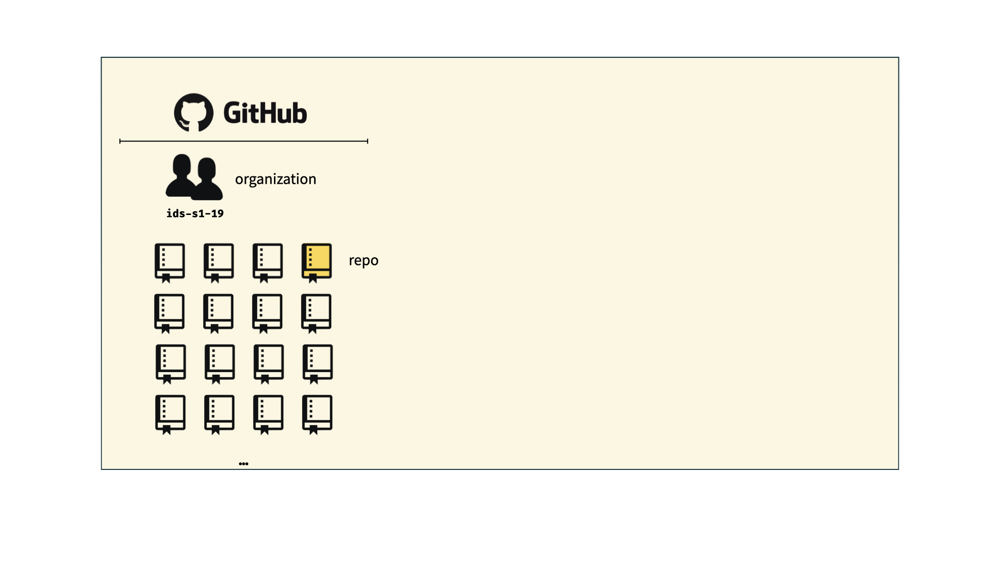

```{r child = "../setup.Rmd"}

```


```{r packages, echo=FALSE, message=FALSE, warning=FALSE}
library(tidyverse)
library(viridis)
library(sugrrants)
library(lubridate)
```


background-image: url("img/phd_comics_vc.gif")
background-size: contain

---

## Course toolkit

<br>

.pull-left[
### .gray[Course operation]
- Content
  - ECLearn
  - Github
- Communication
  - Zoom
  - Teams
]

--


.pull-right[
### .pink[Doing data science]
- .pink[Programming:]
  - .pink[R]
  - .pink[RStudio]
  - .pink[tidyverse]
  - .pink[R Markdown]
- .gray[Version control and collaboration:]
  - .gray[Git]
  - .gray[GitHub]
]

---

## Learning goals

By the end of the course, you will be able to...

--

- gain insight from data

--
- gain insight from data, **reproducibly**

--
- gain insight from data, reproducibly, **using modern programming tools and techniques**

--
- gain insight from data, reproducibly **and collaboratively**, using modern programming tools and techniques

--
- gain insight from data, reproducibly **(with literate programming and version control)** and collaboratively, using modern programming tools and techniques

---

class: middle

# Reproducible data analysis

---

## Reproducibility checklist

.question[
What does it mean for a data analysis to be "reproducible"?
]

--

Near-term goals:

- Are the tables and figures reproducible from the code and data?
- Does the code actually do what you think it does?
- In addition to what was done, is it clear *why* it was done? 
--

- Can someone else easily reproduce the analysis?

--


Long-term goals:
- Can the code be used for other data?
- Can you extend the code to do other things?

---

## Toolkit for reproducibility

- Scriptability $\rightarrow$ R

--

- Literate programming (code, narrative, output in one place) $\rightarrow$ R Markdown

--

- Version control $\rightarrow$ Git / GitHub

---

class: middle

# R and RStudio

---

## R and RStudio

.pull-left[
```{r echo=FALSE, out.width="25%"}
knitr::include_graphics("img/r-logo.png")
```
- R is an open-source statistical **programming language**
- R is also an environment for statistical computing and graphics
- It's easily extensible with *packages*
]

--


.pull-right[
```{r echo=FALSE, out.width="50%"}
knitr::include_graphics("img/rstudio-logo.png")
```
- RStudio is a convenient interface for R called an **IDE** (integrated development environment), e.g. *"I write R code in the RStudio IDE"*
- RStudio is not a requirement for programming with R, but it's very commonly used by R programmers and data scientists
]


---

## R packages

- **Packages** are the fundamental units of reproducible R code. They include reusable R functions, the documentation that describes how to use them, and sample data<sup>1</sup>

--

- As of Feb 1, 2021, there are over 17,051 R packages available on **CRAN** (the Comprehensive R Archive Network)<sup>2</sup>

--

- We're going to work with a small (but important) subset of these!

.footnote[
<sup>1</sup> Wickham and Bryan, [R Packages](https://r-pkgs.org/).

<sup>2</sup> [CRAN contributed packages](https://cran.r-project.org/web/packages/).
]

---

## Tour: R and RStudio

```{r echo=FALSE, out.width="80%"}
knitr::include_graphics("img/tour-r-rstudio.png")
```

---

## A short list (for now) of R essentials

- Functions are (most often) verbs, followed by what they will be applied to in parentheses:

```{r eval=FALSE}
do_this(to_this)
do_that(to_this, to_that, with_those)
```

--

- Packages are installed with the `install.packages` function (remember the quotes) **once per computer**, and loaded with the `library` function, **once per session**:

```{r eval=FALSE}
install.packages("package_name")
library(package_name)
```

---

## R essentials (continued)

- Columns (variables) in data frames are accessed with `$`:


```{r eval=FALSE}
dataframe$var_name
```


--

- Object documentation can be accessed with `?`

```{r eval=FALSE}
?mean
```

---

## tidyverse

.pull-left[
```{r echo=FALSE, out.width="99%"}
knitr::include_graphics("img/tidyverse.png")
```
]

.pull-right[
.center[.large[
[tidyverse.org](https://www.tidyverse.org/)
]]

- The **tidyverse** is an opinionated collection of R packages designed for data science
- All packages share an underlying philosophy and a common grammar
]

---

## rmarkdown

.pull-left[
.center[.large[
[rmarkdown.rstudio.com](https://rmarkdown.rstudio.com/)
]]
 
- **rmarkdown** and the various packages that support it enable R users to write their code and prose in reproducible computational documents 


- We will generally refer to R Markdown documents (with `.Rmd` extension), e.g. *"Do this in your R Markdown document"* and rarely discuss loading the rmarkdown package
]

.pull-right[
```{r echo=FALSE, out.width="50%"}
knitr::include_graphics("img/rmarkdown.png")
# knitr::include_graphics("img/rmarkdown_wizards.png")
```
]


---

background-image: url("img/rmarkdown_wizards.png")
background-size: contain


---

class: middle

# R Markdown

---


## R Markdown

- Fully reproducible reports -- each time you knit the analysis is ran from the beginning
- Simple markdown syntax for text
- Code goes in chunks, defined by three backticks, narrative goes outside of chunks

---


background-image: url("img/meet_RMarkdown.png")
background-size: contain

???

YAML (/ˈjæməl/, rhymes with camel[2]) was first proposed by Clark Evans in 2001,[10] who designed it together with Ingy döt Net[11] and Oren Ben-Kiki.[11] Originally YAML was said to mean Yet Another Markup Language,[12] referencing its purpose as a markup language with the yet another construct, but it was then repurposed as YAML Ain't Markup Language, a recursive acronym, to distinguish its purpose as data-oriented, rather than document markup. - Wikipedia (https://en.wikipedia.org/wiki/YAML) 

---

## Environments

Tip: 
The environment of your R Markdown document is separate from the Console!

> i.e., every time you `knit` a document, it is a fresh stand-alone environment.

--

Remember this, and expect it to bite you a few times as you're learning to work 
with R Markdown!

---

## Environments

.pull-left[
First, run the following in the console
 

```{r eval = FALSE}
x <- 2
x * 3
```


.question[
All looks good, eh?
]
]

--

.pull-right[
Then, add the following in an R chunk in your R Markdown document


```{r eval = FALSE}
x * 3
```


.question[
What happens? Why the error?
]
]

---

## R Markdown help

.pull-left[
.center[
.midi[R Markdown Cheat Sheet  
`Help -> Cheatsheets`]
]
```{r echo=FALSE, out.width="80%"}
knitr::include_graphics("img/rmd-cheatsheet.png")
```
]
.pull-right[
.center[
.midi[Markdown Quick Reference  
`Help -> Markdown Quick Reference`]
]
```{r echo=FALSE, out.width="80%"}
knitr::include_graphics("img/md-cheatsheet.png")
```
]

---

## How will we use R Markdown?

- Every assignment / report / project / etc. is an R Markdown document
- You'll always have a template R Markdown document to start with
- The amount of scaffolding in the template will decrease over the semester

---

## What's with all the hexes?


```{r echo=FALSE, out.width="45%"}
knitr::include_graphics("img/tidyverse_celestial.png")
```


---

class: middle

# Git and GitHub 

---

## Git and GitHub

.pull-left[
```{r echo=FALSE, out.width="25%"}
knitr::include_graphics("img/git-logo.png")
```
- Git is a version control system -- like “Track Changes” features from Microsoft Word, for data science professionals

- It's not the only version control system, but it's a very popular one
]

--


.pull-right[
```{r echo=FALSE, out.width="25%"}
knitr::include_graphics("img/github-logo.png")
```
- GitHub is the home for your Git-based projects on the internet—like DropBox but **much, much better**

- We will use GitHub as a platform for web hosting and collaboration (and as our course management system!)
]

---

## Versioning

```{r echo=FALSE, fig.align = "center", out.width = "70%"}
knitr::include_graphics("img/lego-steps.png")
```

---

## Versioning with human readable messages

```{r echo=FALSE, fig.align = "center", out.width = "60%"}
knitr::include_graphics("img/lego-steps-commit-messages.png")
```

---

## Why do we need version control?

--

```{r echo=FALSE, fig.align = "center", out.width="35%"}
knitr::include_graphics("img/phd_comics_vc.gif")
```

---

## How will we use Git and GitHub?

```{r echo=FALSE, out.width="100%"}
knitr::include_graphics("img/whole-game-01.png")
```

---

## How will we use Git and GitHub?

```{r echo=FALSE, out.width="100%"}

```

---

## How will we use Git and GitHub?

```{r echo=FALSE, out.width="100%"}
knitr::include_graphics("img/whole-game-03.png")
```

---

## How will we use Git and GitHub?

```{r echo=FALSE, out.width="100%"}
knitr::include_graphics("img/whole-game-04.png")
```

---

# Git and GitHub tips

- There are (seemingly) millions of git commands. 99% of the time you will use git to **add, commit, push, and pull**.

--
- We will be doing Git things and interfacing with GitHub through RStudio, but if you google for help you might come across methods for doing these things in the command line -- skip that and move on to the next resource unless you feel comfortable trying it out.

--
- There is a great resource for working with git and R: [happygitwithr.com](http://happygitwithr.com/). Some of the content in there is beyond the scope of this course, but it's a good place to look for help.

---

## Tour: Git and GitHub

- Create a GitHub account
- Verify your GitHub email
- Adjust your GitHub settings for a more pleasant GitHub experience
  - Settings > Emails > Uncheck "Keep my email address private"
  - Settings > Emails > Update name and photo

<br>

*Next class...*

*Work with R, RStudio, Git, and GitHub together!*<sup>+</sup>

.footnote[
<sup>+</sup>Just like a real data scientist!
]

---

# A word to the wise... 

Keep and maintain a sensible directory structure

```
IDDS_2201
  |HW
    |HW_1
      HW_1.Rmd
      HW_1.html
      |img
        an_image.png
    |HW_2
      ...
  |Labs
    ...
  |Final
    ...
  
```

You want each "subdirectory" to be self-contained.

---

# Attributions

Some of the material in this slide deck was inspired by and/or partially adapted from several open-source data science resources, including

- The [R for Data Science](https://r4ds.had.co.nz/) textbook by Hadley Wickham & Garrett Grolemund [CC BY-NC-ND 3.0 US](https://creativecommons.org/licenses/by-nc-nd/3.0/us/) 
- The [datasciencebox](https://github.com/rstudio-education/datascience-box) by Mine Çetinkaya-Rundel [CC BY-SA 4.0](https://creativecommons.org/licenses/by-sa/4.0/) 
- Artwork by @allison_horst [CC BY-SA 4.1](https://creativecommons.org/licenses/by-sa/4.0/) 
