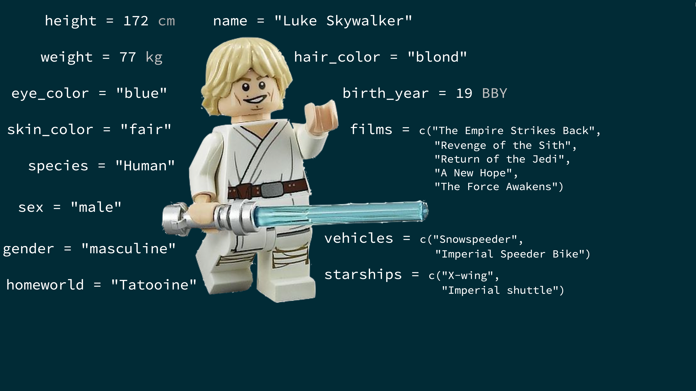
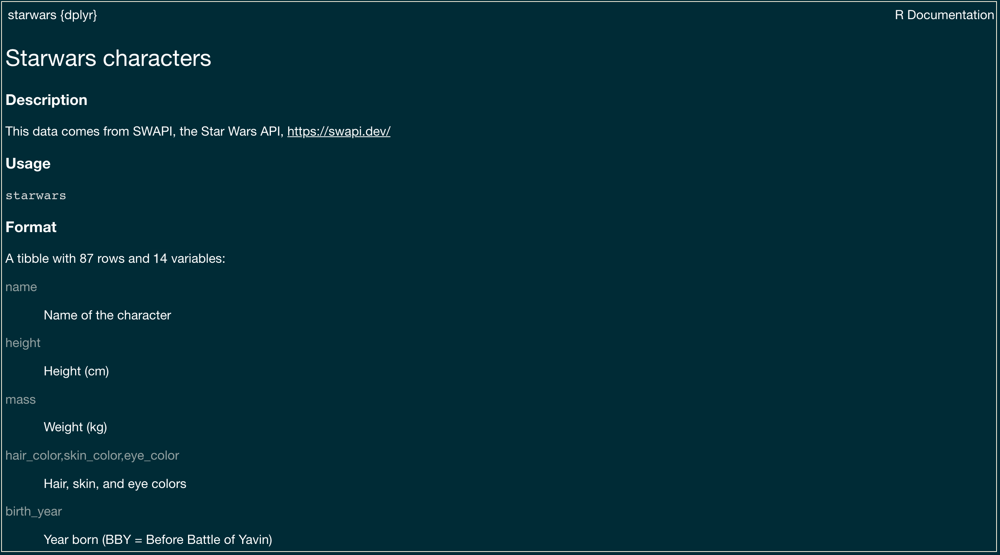
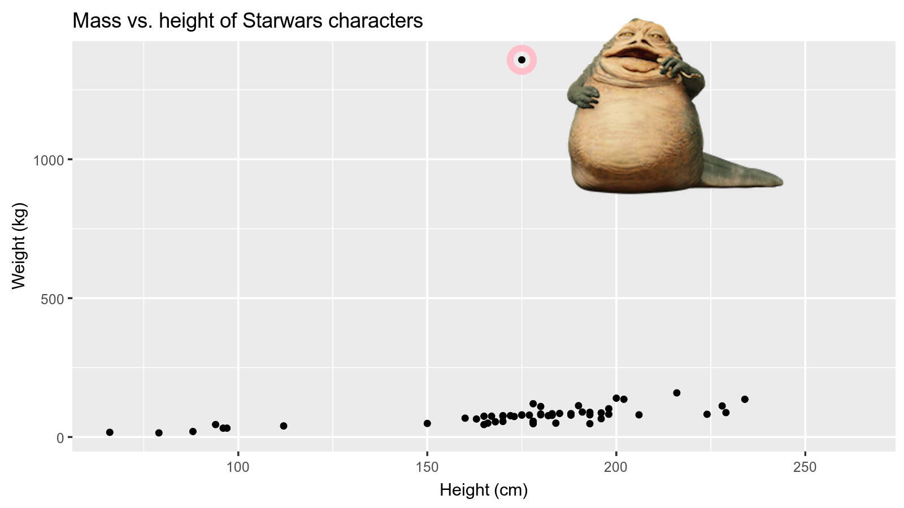
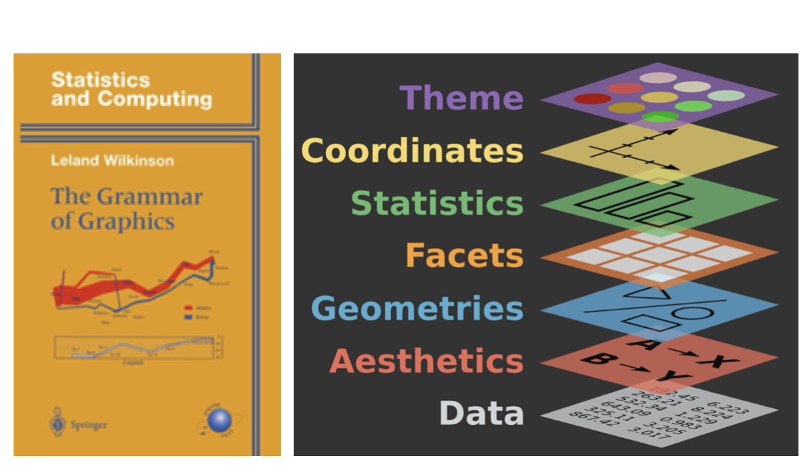

```{r child = "../setup.Rmd"}
```

```{r packages, echo=FALSE, message=FALSE, warning=FALSE}
library(tidyverse)
library(magick)
library(Tmisc)
library(dsbox)
library(palmerpenguins)
```

class: middle

# What is in a dataset?

---

## Dataset terminology

- Each row is an **observation**
- Each column is a **variable**

.small[

```{r message=FALSE}
starwars
```

]

---

## Luke Skywalker



---

## What's in the Star Wars data?

Take a `glimpse` at the data:

```{r}
glimpse(starwars)
```

---

.question[
How many rows and columns does this dataset have?
What does each row represent?
What does each column represent?
]

```{r eval = FALSE}
?starwars
```

```{r echo=FALSE}

```

---

.question[
How many rows and columns does this dataset have?
]

.pull-left[
```{r}
nrow(starwars) # number of rows
ncol(starwars) # number of columns
dim(starwars)  # dimensions (row column)
```
]

---

class: middle

# Exploratory data analysis

---

## What is EDA?

- Exploratory data analysis (EDA) is an approach to analysing data sets to summarize its main characteristics
- Often, this is visual -- this is what we'll focus on first
- But we might also calculate summary statistics and perform data wrangling/manipulation/transformation at (or before) this stage of the analysis -- this is what we'll focus on next

---

## Mass vs. height

.question[ 
How would you describe the relationship between mass and height of Starwars characters?
What other variables would help us understand data points that don't follow the overall trend?
Who is the not so tall but really heavy character?
]

```{r fig.width = 8, warning = FALSE, echo=FALSE, out.width = "50%"}
ggplot(data = starwars, mapping = aes(x = height, y = mass)) +
  geom_point() +
  labs(title = "Mass vs. height of Starwars characters",
       x = "Height (cm)", y = "Weight (kg)") +
  geom_point(data = starwars %>% filter(name == "Jabba Desilijic Tiure"), size = 5, pch = 1, color = "pink", stroke = 3)
```

---

## Jabba!

```{r echo = FALSE, warning = FALSE, cache = TRUE, out.width = "80%"}
jabba <- image_read("img/jabba.png")

fig <- image_graph(width = 1600, height = 900, res = 200)
ggplot(data = starwars, mapping = aes(x = height, y = mass)) +
  geom_point() +
  labs(title = "Mass vs. height of Starwars characters",
       x = "Height (cm)", y = "Weight (kg)") +
  geom_point(data = starwars %>% filter(name == "Jabba Desilijic Tiure"), size = 5, pch = 1, color = "pink", stroke = 3)
dev.off()

out <- fig %>% image_composite(jabba, offset = "+1000+30")

image_write(out, "img/jabbaplot.png", format = "png")

```

---

class: middle

# Data visualization

---

## Data visualization

> *"The simple graph has brought more information to the data analyst's mind than any other device." --- John Tukey*

- Data visualization is the creation and study of the visual representation of data
- Many tools for visualizing data -- R is one of them
- Many approaches/systems within R for making data visualizations -- **ggplot2** is one of them, and that's what we're going to use

---

## ggplot2 $\in$ tidyverse

.pull-left[
```{r echo=FALSE, out.width="80%"}
knitr::include_graphics("img/ggplot2-part-of-tidyverse.png")
```
] 
.pull-right[ 
- **ggplot2** is tidyverse's data visualization package 
- `gg` in "ggplot2" stands for Grammar of Graphics 
- Inspired by the book **Grammar of Graphics** by Leland Wilkinson
]

---

## Grammar of Graphics

.pull-left-narrow[
A grammar of graphics is a tool that enables us to concisely describe the components of a graphic
]
.pull-right-wide[
```{r echo=FALSE, out.width="100%"}

```
]

.footnote[ Source: [BloggoType](http://bloggotype.blogspot.com/2016/08/holiday-notes2-grammar-of-graphics.html)]

---

background-image: url("img/ggplot2_masterpiece.png")
background-size: contain

---

## Mass vs. height

```{r mass-height, fig.width = 8, out.width = "50%"}
ggplot(data = starwars, mapping = aes(x = height, y = mass)) +
  geom_point() +
  labs(title = "Mass vs. height of Starwars characters",
       x = "Height (cm)", y = "Weight (kg)")
```

---

.question[ 
- What are the functions doing the plotting?
- What is the dataset being plotted?
- Which variables map to which features (aesthetics) of the plot?
- What does the warning mean?<sup>+</sup>
]

```{r ref.label="mass-height", fig.show = "hide"}
```

.footnote[
<sup>+</sup>Suppressing warning to subsequent slides to save space
]

---

## Hello ggplot2!

.pull-left-wide[
- `ggplot()` is the main function in ggplot2
- Plots are constructed in layers
- Structure of the code for plots can be summarized as

```{r eval = FALSE}
ggplot(data = [dataset], 
       mapping = aes(x = [x-variable], y = [y-variable])) +
  geom_xxx() +
  other options
```

- The ggplot2 package comes with the tidyverse

```{r}
library(tidyverse)
```

- For help with ggplot2, see [ggplot2.tidyverse.org](http://ggplot2.tidyverse.org/)
]

---

class: middle

# Why do we visualize?

---

## Anscombe's quartet

```{r quartet-for-show, eval = FALSE, echo = FALSE}
library(Tmisc)
quartet
```

.pull-left[
```{r quartet-view1, echo = FALSE}
quartet[1:22,]
```
] 
.pull-right[
```{r quartet-view2, echo = FALSE}
quartet[23:44,]
```
]

---

## Summarising Anscombe's quartet

```{r quartet-summary}
quartet %>%
  group_by(set) %>%
  summarise(
    mean_x = mean(x), 
    mean_y = mean(y),
    sd_x = sd(x),
    sd_y = sd(y),
    r = cor(x, y)
  )
```

---

## Visualizing Anscombe's quartet

```{r quartet-plot, echo = FALSE, out.width = "80%", fig.asp = 0.5}
ggplot(quartet, aes(x = x, y = y)) +
  geom_point() +
  facet_wrap(~ set, ncol = 4)
```

---


class: middle

# ggplot2 `r emo::ji("heart")` `r emo::ji("penguin")`

---

## ggplot2 $\in$ tidyverse

.pull-left[
```{r echo=FALSE, out.width="80%"}
knitr::include_graphics("img/ggplot2-part-of-tidyverse.png")
```
] 
.pull-right[ 
- **ggplot2** is tidyverse's data visualization package 
- Structure of the code for plots can be summarized as

```{r eval = FALSE}
ggplot(data = [dataset], 
       mapping = aes(x = [x-variable], 
                     y = [y-variable])) +
   geom_xxx() +
   other options
```
]

---

## Data: Palmer Penguins

Measurements for penguin species, island in Palmer Archipelago, size (flipper length, body mass, bill dimensions), and sex.

.pull-left-narrow[
```{r echo=FALSE, out.width="80%"}
knitr::include_graphics("img/penguins.png")
```
]
.pull-right-wide[
```{r}
library(palmerpenguins)
glimpse(penguins)
```
]


---

.panelset[
.panel[.panel-name[Plot]
```{r ref.label = "penguins", echo = FALSE, warning = FALSE, out.width = "70%", fig.width = 8}
```
]
.panel[.panel-name[Code]

```{r penguins, fig.show = "hide"}
ggplot(data = penguins, 
       mapping = aes(x = bill_depth_mm, y = bill_length_mm,
                     color = species)) +
  geom_point() +
  labs(title = "Bill depth and length",
       subtitle = "Dimensions for Adelie, Chinstrap, and Gentoo Penguins",
       x = "Bill depth (mm)", y = "Bill length (mm)",
       color = "Species")
```
]
]

---

class: middle

# Coding out loud

---

.midi[
> **Start with the `penguins` data frame**
]

.pull-left[
```{r penguins-0, fig.show = "hide", warning = FALSE}
ggplot(data = penguins) #<<
```
]
.pull-right[
```{r ref.label = "penguins-0", echo = FALSE, warning = FALSE, out.width = "100%", fig.width = 8}
```
]

---

.midi[
> Start with the `penguins` data frame,
> **map bill depth to the x-axis**
]

.pull-left[
```{r penguins-1, fig.show = "hide", warning = FALSE}
ggplot(data = penguins,
       mapping = aes(x = bill_depth_mm)) #<<
```
]
.pull-right[
```{r ref.label = "penguins-1", echo = FALSE, warning = FALSE, out.width = "100%", fig.width = 8}
```
]

---

.midi[
> Start with the `penguins` data frame,
> map bill depth to the x-axis
> **and map bill length to the y-axis.**
]

.pull-left[
```{r penguins-2, fig.show = "hide", warning = FALSE}
ggplot(data = penguins,
       mapping = aes(x = bill_depth_mm,
                     y = bill_length_mm)) #<<
```
]
.pull-right[
```{r ref.label = "penguins-2", echo = FALSE, warning = FALSE, out.width = "100%", fig.width = 8}
```
]

---

.midi[
> Start with the `penguins` data frame,
> map bill depth to the x-axis
> and map bill length to the y-axis. 
> **Represent each observation with a point**
]

.pull-left[
```{r penguins-3, fig.show = "hide", warning = FALSE}
ggplot(data = penguins,
       mapping = aes(x = bill_depth_mm,
                     y = bill_length_mm)) + 
  geom_point() #<<
```
]
.pull-right[
```{r ref.label = "penguins-3", echo = FALSE, warning = FALSE, out.width = "100%", fig.width = 8}
```
]

---

.midi[
> Start with the `penguins` data frame,
> map bill depth to the x-axis
> and map bill length to the y-axis. 
> Represent each observation with a point
> **and map species to the color of each point.**
]

.pull-left[
```{r penguins-4, fig.show = "hide", warning = FALSE}
ggplot(data = penguins,
       mapping = aes(x = bill_depth_mm,
                     y = bill_length_mm,
                     color = species)) + #<<
  geom_point()
```
]
.pull-right[
```{r ref.label = "penguins-4", echo = FALSE, warning = FALSE, out.width = "100%", fig.width = 8}
```
]

---

.midi[
> Start with the `penguins` data frame,
> map bill depth to the x-axis
> and map bill length to the y-axis. 
> Represent each observation with a point
> and map species to the color of each point.
> **Title the plot "Bill depth and length"**
]

.pull-left[
```{r penguins-5, fig.show = "hide", warning = FALSE}
ggplot(data = penguins,
       mapping = aes(x = bill_depth_mm,
                     y = bill_length_mm,
                     color = species)) +
  geom_point() +
  labs(title = "Bill depth and length") #<<
```
]
.pull-right[
```{r ref.label = "penguins-5", echo = FALSE, warning = FALSE, out.width = "100%", fig.width = 8}
```
]

---

.midi[
> Start with the `penguins` data frame,
> map bill depth to the x-axis
> and map bill length to the y-axis. 
> Represent each observation with a point
> and map species to the color of each point.
> Title the plot "Bill depth and length", 
> **add the subtitle "Dimensions for Adelie, Chinstrap, and Gentoo Penguins"**
]

.pull-left[
```{r penguins-6, fig.show = "hide", warning = FALSE}
ggplot(data = penguins,
       mapping = aes(x = bill_depth_mm,
                     y = bill_length_mm,
                     color = species)) +
  geom_point() +
  labs(title = "Bill depth and length",
       subtitle = "Dimensions for Adelie, Chinstrap, and Gentoo Penguins") #<<
```
]
.pull-right[
```{r ref.label = "penguins-6", echo = FALSE, warning = FALSE, out.width = "100%", fig.width = 8}
```
]

---

.midi[
> Start with the `penguins` data frame,
> map bill depth to the x-axis
> and map bill length to the y-axis. 
> Represent each observation with a point
> and map species to the color of each point.
> Title the plot "Bill depth and length", 
> add the subtitle "Dimensions for Adelie, Chinstrap, and Gentoo Penguins", 
> **label the x and y axes as "Bill depth (mm)" and "Bill length (mm)", respectively**
]

.pull-left[
```{r penguins-7, fig.show = "hide", warning = FALSE}
ggplot(data = penguins,
       mapping = aes(x = bill_depth_mm,
                     y = bill_length_mm,
                     color = species)) +
  geom_point() +
  labs(title = "Bill depth and length",
       subtitle = "Dimensions for Adelie, Chinstrap, and Gentoo Penguins",
       x = "Bill depth (mm)", y = "Bill length (mm)") #<<
```
]
.pull-right[
```{r ref.label = "penguins-7", echo = FALSE, warning = FALSE, out.width = "100%", fig.width = 8}
```
]

---

.midi[
> Start with the `penguins` data frame,
> map bill depth to the x-axis
> and map bill length to the y-axis. 
> Represent each observation with a point
> and map species to the color of each point.
> Title the plot "Bill depth and length", 
> add the subtitle "Dimensions for Adelie, Chinstrap, and Gentoo Penguins", 
> label the x and y axes as "Bill depth (mm)" and "Bill length (mm)", respectively,
> **label the legend "Species"**
]

.pull-left[
```{r penguins-8, fig.show = "hide", warning = FALSE}
ggplot(data = penguins,
       mapping = aes(x = bill_depth_mm,
                     y = bill_length_mm,
                     color = species)) +
  geom_point() +
  labs(title = "Bill depth and length",
       subtitle = "Dimensions for Adelie, Chinstrap, and Gentoo Penguins",
       x = "Bill depth (mm)", y = "Bill length (mm)",
       color = "Species") #<<
```
]
.pull-right[
```{r ref.label = "penguins-8", echo = FALSE, warning = FALSE, out.width = "100%", fig.width = 8}
```
]

---

.midi[
> Start with the `penguins` data frame,
> map bill depth to the x-axis
> and map bill length to the y-axis. 
> Represent each observation with a point
> and map species to the color of each point.
> Title the plot "Bill depth and length", 
> add the subtitle "Dimensions for Adelie, Chinstrap, and Gentoo Penguins", 
> label the x and y axes as "Bill depth (mm)" and "Bill length (mm)", respectively,
> label the legend "Species", 
> **and add a caption for the data source.**
]

.pull-left[
```{r penguins-9, fig.show = "hide", warning = FALSE}
ggplot(data = penguins,
       mapping = aes(x = bill_depth_mm,
                     y = bill_length_mm,
                     color = species)) +
  geom_point() +
  labs(title = "Bill depth and length",
       subtitle = "Dimensions for Adelie, Chinstrap, and Gentoo Penguins",
       x = "Bill depth (mm)", y = "Bill length (mm)",
       color = "Species",
       caption = "Source: Palmer Station LTER / palmerpenguins package") #<<
```
]
.pull-right[
```{r ref.label = "penguins-9", echo = FALSE, warning = FALSE, out.width = "100%", fig.width = 8}
```
]

---

.midi[
> Start with the `penguins` data frame,
> map bill depth to the x-axis
> and map bill length to the y-axis. 
> Represent each observation with a point
> and map species to the color of each point.
> Title the plot "Bill depth and length", 
> add the subtitle "Dimensions for Adelie, Chinstrap, and Gentoo Penguins", 
> label the x and y axes as "Bill depth (mm)" and "Bill length (mm)", respectively,
> label the legend "Species", 
> and add a caption for the data source.
> **Finally, use a discrete color scale that is designed to be perceived by viewers with common forms of color blindness.**
]

.pull-left[
```{r penguins-10, fig.show = "hide", warning = FALSE}
ggplot(data = penguins,
       mapping = aes(x = bill_depth_mm,
                     y = bill_length_mm,
                     color = species)) +
  geom_point() +
  labs(title = "Bill depth and length",
       subtitle = "Dimensions for Adelie, Chinstrap, and Gentoo Penguins",
       x = "Bill depth (mm)", y = "Bill length (mm)",
       color = "Species",
       caption = "Source: Palmer Station LTER / palmerpenguins package") +
  scale_color_viridis_d() #<<
```
]
.pull-right[
```{r ref.label = "penguins-10", echo = FALSE, warning = FALSE, out.width = "100%", fig.width = 8}
```
]

---

.panelset[
.panel[.panel-name[Plot]
```{r ref.label="penguins-10-nohighlight", echo = FALSE, warning = FALSE, out.width = "70%", fig.width = 8}
```
]
.panel[.panel-name[Code]

```{r penguins-10-nohighlight, fig.show = "hide"}
ggplot(data = penguins,
       mapping = aes(x = bill_depth_mm,
                     y = bill_length_mm,
                     color = species)) +
  geom_point() +
  labs(title = "Bill depth and length",
       subtitle = "Dimensions for Adelie, Chinstrap, and Gentoo Penguins",
       x = "Bill depth (mm)", y = "Bill length (mm)",
       color = "Species",
       caption = "Source: Palmer Station LTER / palmerpenguins package") +
  scale_color_viridis_d()
```
]
.panel[.panel-name[Narrative]
.pull-left-wide[
.midi[
Start with the `penguins` data frame,
map bill depth to the x-axis
and map bill length to the y-axis. 

Represent each observation with a point
and map species to the color of each point.

Title the plot "Bill depth and length", 
add the subtitle "Dimensions for Adelie, Chinstrap, and Gentoo Penguins", 
label the x and y axes as "Bill depth (mm)" and "Bill length (mm)", respectively,
label the legend "Species", 
and add a caption for the data source.

Finally, use a discrete color scale that is designed to be perceived by viewers with common forms of color blindness.
]
]
]
]

---

## Argument names

.tip[
You can omit the names of first two arguments when building plots with `ggplot()`.
]

.pull-left[
```{r named-args, eval = FALSE}
ggplot(data = penguins,
       mapping = aes(x = bill_depth_mm,
                     y = bill_length_mm,
                     color = species)) +
  geom_point() +
  scale_color_viridis_d()
```
]
.pull-right[
```{r not-named-args, eval = FALSE}
ggplot(penguins,
       aes(x = bill_depth_mm,
           y = bill_length_mm,
           color = species)) +
  geom_point() +
  scale_color_viridis_d()
```
]

---

class: middle

# Aesthetics

---

## Aesthetics options

Commonly used characteristics of plotting characters that can be **mapped to a specific variable** in the data are

- `color`
- `shape`
- `size`
- `alpha` (transparency)

---

## Color

.pull-left[
```{r color, fig.show = "hide", warning = FALSE}
ggplot(penguins,
       aes(x = bill_depth_mm, 
           y = bill_length_mm,
           color = species)) + #<<
  geom_point() +
  scale_color_viridis_d()
```
]
.pull-right[
```{r ref.label = "color", echo = FALSE, warning = FALSE, out.width = "100%"}
```
]

---

## Shape

Mapped to a different variable than `color`

.pull-left[
```{r shape-island, fig.show = "hide", warning = FALSE}
ggplot(penguins,
       aes(x = bill_depth_mm, 
           y = bill_length_mm,
           color = species,
           shape = island)) + #<<
  geom_point() +
  scale_color_viridis_d()
```
]
.pull-right[
```{r ref.label = "shape-island", echo = FALSE, warning = FALSE, out.width = "100%"}
```
]

---

## Shape

Mapped to same variable as `color`

.pull-left[
```{r shape-species, fig.show = "hide", warning = FALSE}
ggplot(penguins,
       aes(x = bill_depth_mm, 
           y = bill_length_mm,
           color = species,
           shape = species)) + #<<
  geom_point() +
  scale_color_viridis_d()
```
]
.pull-right[
```{r ref.label = "shape-species", echo = FALSE, warning = FALSE, out.width = "100%"}
```
]

---

## Size

.pull-left[
```{r size, fig.show = "hide", warning = FALSE}
ggplot(penguins,
       aes(x = bill_depth_mm, 
           y = bill_length_mm,
           color = species,
           shape = species,
           size = body_mass_g)) + #<<
  geom_point() +
  scale_color_viridis_d()
```
]
.pull-right[
```{r ref.label = "size", echo = FALSE, warning = FALSE, out.width = "100%"}
```
]

---

## Alpha

.pull-left[
```{r alpha, fig.show = "hide", warning = FALSE}
ggplot(penguins,
       aes(x = bill_depth_mm, 
           y = bill_length_mm,
           color = species,
           shape = species,
           size = body_mass_g,
           alpha = flipper_length_mm)) + #<<
  geom_point() +
  scale_color_viridis_d()
```
]
.pull-right[
```{r ref.label = "alpha", echo = FALSE, warning = FALSE, out.width = "100%"}
```
]

---

.pull-left[
**Mapping**

```{r warning = FALSE, out.width = "100%"}
ggplot(penguins,
       aes(x = bill_depth_mm,
           y = bill_length_mm,
           size = body_mass_g, #<<
           alpha = flipper_length_mm)) + #<<
  geom_point()
```
]
.pull-right[
**Setting**

```{r warning = FALSE, out.width = "100%"}
ggplot(penguins,
       aes(x = bill_depth_mm,
           y = bill_length_mm)) + 
  geom_point(size = 2, alpha = 0.5) #<<
```
]

---

## Mapping vs. setting

- **Mapping:** Determine the size, alpha, etc. of points based on the values of a variable in the data
  - goes into `aes()`

- **Setting:** Determine the size, alpha, etc. of points **not** based on the values of a variable in the data
  - goes into `geom_*()` (this was `geom_point()` in the previous example, but we'll learn about other geoms soon!)
  
---

class: middle

# Faceting

---

## Faceting

- Smaller plots that display different subsets of the data
- Useful for exploring conditional relationships and large data

---

.panelset[
.panel[.panel-name[Plot]
```{r ref.label = "facet", echo = FALSE, warning = FALSE, out.width = "70%"}
```
]
.panel[.panel-name[Code]

```{r facet, fig.show = "hide"}
ggplot(penguins, aes(x = bill_depth_mm, y = bill_length_mm)) + 
  geom_point() +
  facet_grid(species ~ island) #<<
```
]
]

---

## Various ways to facet

.question[
In the next few slides describe what each plot displays. Think about how the code relates to the output.

**Note:** The plots in the next few slides do not have proper titles, axis labels, etc. because we want you to figure out what's happening in the plots.
But you should always label your plots!
]

---

```{r warning = FALSE}
ggplot(penguins, aes(x = bill_depth_mm, y = bill_length_mm)) + 
  geom_point() +
  facet_grid(species ~ sex) #<<
```

---

```{r warning = FALSE}
ggplot(penguins, aes(x = bill_depth_mm, y = bill_length_mm)) + 
  geom_point() +
  facet_grid(sex ~ species) #<<
```

---

```{r warning = FALSE, fig.asp = 0.5}
ggplot(penguins, aes(x = bill_depth_mm, y = bill_length_mm)) + 
  geom_point() +
  facet_wrap(~ species) #<<
```

---

```{r warning = FALSE, fig.asp = 0.5}
ggplot(penguins, aes(x = bill_depth_mm, y = bill_length_mm)) + 
  geom_point() +
  facet_grid(. ~ species) #<<
```

---

```{r warning = FALSE}
ggplot(penguins, aes(x = bill_depth_mm, y = bill_length_mm)) + 
  geom_point() +
  facet_wrap(~ species, ncol = 2) #<<
```

---

## Faceting summary

- `facet_grid()`:
    - 2d grid
    - `rows ~ cols`
    - use `.` for no split
- `facet_wrap()`: 1d ribbon wrapped according to number of rows and columns specified or available plotting area

---

## Facet and color

.pull-left-narrow[
```{r facet-color-legend, fig.show = "hide", warning = FALSE}
ggplot(
  penguins, 
  aes(x = bill_depth_mm, 
      y = bill_length_mm, 
      color = species)) + #<<
  geom_point() +
  facet_grid(species ~ sex) +
  scale_color_viridis_d() #<<
```
]
.pull-right-wide[
```{r ref.label = "facet-color-legend", echo = FALSE, warning = FALSE, out.width = "100%"}
```
]

---

## Face and color, no legend

.pull-left-narrow[
```{r facet-color-no-legend, fig.show = "hide", warning = FALSE}
ggplot(
  penguins, 
  aes(x = bill_depth_mm, 
      y = bill_length_mm, 
      color = species)) +
  geom_point() +
  facet_grid(species ~ sex) +
  scale_color_viridis_d() +
  guides(color = FALSE) #<<
```
]
.pull-right-wide[
```{r ref.label = "facet-color-no-legend", echo = FALSE, warning = FALSE, out.width = "100%"}
```
]


---

# Attributions

Some of the material in this slide deck was inspired by and/or partially adapted from several open-source data science resources, including

- The [R for Data Science](https://r4ds.had.co.nz/) textbook by Hadley Wickham & Garrett Grolemund [CC BY-NC-ND 3.0 US](https://creativecommons.org/licenses/by-nc-nd/3.0/us/) 
- The [datasciencebox](https://github.com/rstudio-education/datascience-box) by Mine Çetinkaya-Rundel [CC BY-SA 4.0](https://creativecommons.org/licenses/by-sa/4.0/) 
- Artwork by @allison_horst [CC BY-SA 4.1](https://creativecommons.org/licenses/by-sa/4.0/) 
