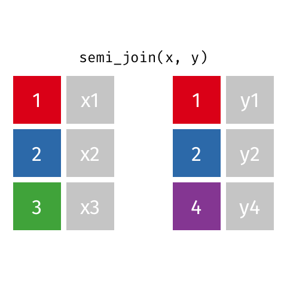

```{r child = "../setup.Rmd"}
```

```{r packages, echo=FALSE, message=FALSE, warning=FALSE}
library(tidyverse)
library(knitr)
options(
  dplyr.print_min = 10, 
  dplyr.print_max = 10
  )
```


class: middle

# .hand[We...]

.huge[.green[have]] .hand[multiple data frames]

.huge[.pink[want]] .hand[to bring them together]

---

```{r include=FALSE}
professions <- read_csv("data/scientists/professions.csv")
dates <- read_csv("data/scientists/dates.csv")
works <- read_csv("data/scientists/works.csv")
```

## Data: Women in science 

Information on 10 women in science who changed the world

.small[
```{r echo=FALSE}
professions %>% select(name) %>% kable()
```
]


.footnote[
Source: [Discover Magazine](https://www.discovermagazine.com/the-sciences/meet-10-women-in-science-who-changed-the-world)
]

---

## Inputs

.panelset[

.panel[.panel-name[professions]
```{r}
professions
```
]

.panel[.panel-name[dates]
```{r}
dates
```
]

.panel[.panel-name[works]
```{r}
works
```
]

]

---

## Desired output

```{r echo=FALSE}
professions %>%
  left_join(dates) %>%
  left_join(works)
```

---

## Inputs, reminder

.pull-left[
```{r}
names(professions)
names(dates)
names(works)
```
]
.pull-right[
```{r}
nrow(professions)
nrow(dates)
nrow(works)
```
]

---

class: middle

# Joining data frames

---

## Joining data frames

```{r eval=FALSE}
something_join(x, y)
```

- `left_join()`: all rows from x
- `right_join()`: all rows from y
- `full_join()`: all rows from both x and y
- `semi_join()`: all rows from x where there are matching values in y, keeping just columns from x
- `inner_join()`: all rows from x where there are matching values in y, return 
all combination of multiple matches in the case of multiple matches
- `anti_join()`: return all rows from x where there are not matching values in y, never duplicate rows of x
- ...
 
---

## Setup

For the next few slides...

.pull-left[
```{r echo=FALSE}
x <- tibble(
  id = c(1, 2, 3),
  value_x = c("x1", "x2", "x3")
  )
```
```{r}
x
```
]
.pull-right[
```{r echo=FALSE}
y <- tibble(
  id = c(1, 2, 4),
  value_y = c("y1", "y2", "y4")
  )
```
```{r}
y
```
]

---

## `left_join()`

.pull-left[
```{r echo=FALSE, out.width="80%", out.extra ='style="background-color: #FDF6E3"'}
include_graphics("img/left-join.gif")
```
]
.pull-right[
```{r}
left_join(x, y)
```
]

---

## `left_join()`

```{r}
professions %>%
  left_join(dates) #<<
```

---

## `right_join()`

.pull-left[
```{r echo=FALSE, out.width="80%", out.extra ='style="background-color: #FDF6E3"'}
include_graphics("img/right-join.gif")
```
]
.pull-right[
```{r}
right_join(x, y)
```
]

---

## `right_join()`


```{r}
professions %>%
  right_join(dates) #<<
```

---

## `full_join()`

.pull-left[
```{r echo=FALSE, out.width="80%", out.extra ='style="background-color: #FDF6E3"'}
include_graphics("img/full-join.gif")
```
]
.pull-right[
```{r}
full_join(x, y)
```
]

---

## `full_join()`

```{r}
dates %>%
  full_join(works) #<<
```

---

## `inner_join()`

.pull-left[
```{r echo=FALSE, out.width="80%", out.extra ='style="background-color: #FDF6E3"'}

```
]
.pull-right[
```{r}
inner_join(x, y)
```
]

---

## `inner_join()`

```{r}
dates %>%
  inner_join(works) #<<
```

---

## `semi_join()`

.pull-left[
```{r echo=FALSE, out.width="80%", out.extra ='style="background-color: #FDF6E3"'}

```
]
.pull-right[
```{r}
semi_join(x, y)
```
]

---

## `semi_join()`

```{r}
dates %>%
  semi_join(works) #<<
```

---

## `anti_join()`

.pull-left[
```{r echo=FALSE, out.width="80%", out.extra ='style="background-color: #FDF6E3"'}
include_graphics("img/anti-join.gif")
```
]
.pull-right[
```{r}
anti_join(x, y)
```
]

---

## `anti_join()`

```{r}
dates %>%
  anti_join(works) #<<
```

---

## Putting it altogether

```{r}
professions %>%
  left_join(dates) %>%
  left_join(works)
```

---

class: middle

# Case study: Student records

---

## Student records

- Have:
  - Enrolment: official university enrolment records
  - Survey: Student provided info missing students who never filled it out and including students who filled it out but dropped the class
- Want: Survey info for all enrolled in class 

--

```{r include=FALSE}
enrolment <- read_csv("data/students/enrolment.csv")
survey <- read_csv("data/students/survey.csv")
```

.pull-left[
```{r message = FALSE}
enrolment
```
]
.pull-right[
```{r message = FALSE}
survey
```
]

---

## Student records

.panelset[

.panel[.panel-name[In class]
```{r}
enrolment %>% 
  left_join(survey, by = "id") #<<
```
]

.panel[.panel-name[Survey missing]
```{r}
enrolment %>% 
  anti_join(survey, by = "id") #<<
```
]

.panel[.panel-name[Dropped]
```{r}
survey %>% 
  anti_join(enrolment, by = "id") #<<
```
]

]

---

class: middle

# Case study: Grocery sales

---

## Grocery sales

- Have:
  - Purchases: One row per customer per item, listing purchases they made
  - Prices: One row per item in the store, listing their prices
- Want: Total revenue

--

```{r include=FALSE}
purchases <- read_csv("data/sales/purchases.csv")
prices <- read_csv("data/sales/prices.csv")
```

.pull-left[
```{r message = FALSE}
purchases
```
]
.pull-right[
```{r message = FALSE}
prices
```
]

---

## Grocery sales

.panelset[

.panel[.panel-name[Total revenue]
.pull-left[
```{r}
purchases %>% 
  left_join(prices) #<<
```
]
.pull-right[
```{r}
purchases %>% 
  left_join(prices) %>%
  summarise(total_revenue = sum(price)) #<<
```
]
]

.panel[.panel-name[Revenue per customer]

.pull-left[
```{r}
purchases %>% 
  left_join(prices)
```
]
.pull-right[
```{r}
purchases %>% 
  left_join(prices) %>%
  group_by(customer_id) %>% #<<
  summarise(total_revenue = sum(price))
```
]

]

]

---

class: middle

# Tidy data


---


class: middle

# .hand[We...]

.huge[.green[have]] .hand[data organised in an unideal way for our analysis]

.huge[.pink[want]] .hand[to reorganise the data to carry on with our analysis]

---

## Data: Sales

```{r include=FALSE}
customers <- read_csv("data/sales/customers.csv")
prices <- read_csv("data/sales/prices.csv")
```


<br>

.pull-left[
### .green[We have...]
```{r echo=FALSE}
customers
```
]

--
.pull-right[
### .pink[We want...]
```{r echo=FALSE}
customers %>%
  pivot_longer(cols = item_1:item_3, names_to = "item_no", values_to = "item")
```
]

---

## A grammar of data tidying

.pull-left[
```{r dplyr-part-of-tidyverse, echo=FALSE, out.width="60%", caption = "tidyr is part of the tidyverse"}
include_graphics("img/tidyr-part-of-tidyverse.png")
```
]
.pull-right[
The goal of tidyr is to help you tidy your data via

- pivoting for going between wide and long data
- splitting and combining character columns
- nesting and unnesting columns
- clarifying how `NA`s should be treated
]

---

class: middle

# Pivoting data

---

## Not this...

```{r echo=FALSE,out.width="70%"}

```

---

## but this!

.center[
```{r echo=FALSE, out.width="45%", out.extra ='style="background-color: #FDF6E3"'}
include_graphics("img/tidyr-longer-wider.gif")
```
]

---

## Wider vs. longer

.pull-left[
### .green[wider]
more columns
```{r echo=FALSE}
customers
```
]

--
.pull-right[
### .pink[longer]
more rows
```{r echo=FALSE}
customers %>%
  pivot_longer(cols = item_1:item_3, names_to = "item_no", values_to = "item")
```
]

---

## `pivot_longer()`

.pull-left[
- `data` (as usual)
]
.pull-right[
```{r eval=FALSE}
pivot_longer(
  data, #<<
  cols, 
  names_to = "name", 
  values_to = "value"
  )
```
]

---

## `pivot_longer()`

.pull-left[
- `data` (as usual)
- `cols`: columns to pivot into longer format 
]
.pull-right[
```{r eval=FALSE}
pivot_longer(
  data, 
  cols, #<<
  names_to = "name", 
  values_to = "value"
  )
```
]

---

## `pivot_longer()`

.pull-left[
- `data` (as usual)
- `cols`: columns to pivot into longer format 
- `names_to`: name of the column where column names of pivoted variables go (character string)
]
.pull-right[
```{r eval=FALSE}
pivot_longer(
  data, 
  cols, 
  names_to = "name", #<<
  values_to = "value"
  )
```
]

---

## `pivot_longer()`

.pull-left[
- `data` (as usual)
- `cols`: columns to pivot into longer format 
- `names_to`: name of the column where column names of pivoted variables go (character string)
- `values_to`: name of the column where data in pivoted variables go (character string)
]
.pull-right[
```{r eval=FALSE}
pivot_longer(
  data, 
  cols, 
  names_to = "name", 
  values_to = "value" #<<
  )
```
]

---

## Customers $\rightarrow$ purchases

```{r}
purchases <- customers %>%
  pivot_longer( #<<
    cols = item_1:item_3,  # variables item_1 to item_3 #<<
    names_to = "item_no",  # column names -> new column called item_no #<<
    values_to = "item"     # values in columns -> new column called item #<<
    ) #<<

purchases
```

---

## Why pivot?

Most likely, because the next step of your analysis needs it

--

.pull-left[
```{r}
prices
```
]
.pull-right[
```{r}
purchases %>%
  left_join(prices) #<<
```
]

---

## Purchases $\rightarrow$ customers

.pull-left-narrow[
- `data` (as usual)
- `names_from`: which column in the long format contains the what should be column names in the wide format
- `values_from`: which column in the long format contains the what should be values in the new columns in the wide format
]
.pull-right-wide[
```{r}
purchases %>%
  pivot_wider( #<<
    names_from = item_no, #<<
    values_from = item #<<
  ) #<<
```
]

---

class: middle

# Case study: Approval rating of Donald Trump

---

```{r echo=FALSE, out.width="70%"}
knitr::include_graphics("img/trump-approval.png")
```

.footnote[
Source: [FiveThirtyEight](https://projects.fivethirtyeight.com/trump-approval-ratings/adults/)
]

---

## Data

```{r include=FALSE}
trump <- read_csv("data/trump/trump_full.csv")
```

```{r}
trump
```

---

## Goal

.pull-left-wide[
```{r echo=FALSE, out.width="100%"}
trump %>%
  pivot_longer(
    cols = c(approval, disapproval),
    names_to = "rating_type",
    values_to = "rating_value"
  ) %>%
  ggplot(aes(x = date, y = rating_value, 
             color = rating_type, group = rating_type)) +
  geom_line() +
  facet_wrap(~ subgroup) +
  scale_color_manual(values = c("darkgreen", "orange")) + 
  labs( 
    x = "Date", y = "Rating", 
    color = NULL, 
    title = "How (un)popular is Donald Trump?", 
    subtitle = "Estimates based on polls of all adults and polls of likely/registered voters", 
    caption = "Source: FiveThirtyEight modeling estimates" 
  ) + 
  theme_minimal() +
  theme(legend.position = "bottom")
```
]
--
.pull-right-narrow[
**Aesthetic mappings:**  
`r emo::ji("check")`  x = `date`  
`r emo::ji("x")`      y = `rating_value`  
`r emo::ji("x")`      color = `rating_type`

**Facet:**  
`r emo::ji("check")`  `subgroup` (Adults and Voters)
]

---

## Pivot

```{r output.lines=11}
trump_longer <- trump %>%
  pivot_longer(
    cols = c(approval, disapproval),
    names_to = "rating_type",
    values_to = "rating_value"
  )

trump_longer
```

---

## Plot

```{r fig.asp = 0.5}
ggplot(trump_longer, 
       aes(x = date, y = rating_value, color = rating_type, group = rating_type)) +
  geom_line() +
  facet_wrap(~ subgroup)
```

---

.panelset[

.panel[.panel-name[Code]
```{r "trump-plot", fig.show="hide"}
ggplot(trump_longer, 
       aes(x = date, y = rating_value, 
           color = rating_type, group = rating_type)) +
  geom_line() +
  facet_wrap(~ subgroup) +
  scale_color_manual(values = c("darkgreen", "orange")) + #<<
  labs( #<<
    x = "Date", y = "Rating", #<<
    color = NULL, #<<
    title = "How (un)popular is Donald Trump?", #<<
    subtitle = "Estimates based on polls of all adults and polls of likely/registered voters", #<<
    caption = "Source: FiveThirtyEight modeling estimates" #<<
  ) #<<
```
]

.panel[.panel-name[Plot]
```{r ref.label="trump-plot", echo = FALSE, out.width="75%"}
```
]

]

---

.panelset[

.panel[.panel-name[Code]
```{r "trump-plot-2", fig.show="hide"}
ggplot(trump_longer, 
       aes(x = date, y = rating_value, 
           color = rating_type, group = rating_type)) +
  geom_line() +
  facet_wrap(~ subgroup) +
  scale_color_manual(values = c("darkgreen", "orange")) + 
  labs( 
    x = "Date", y = "Rating", 
    color = NULL, 
    title = "How (un)popular is Donald Trump?", 
    subtitle = "Estimates based on polls of all adults and polls of likely/registered voters", 
    caption = "Source: FiveThirtyEight modeling estimates" 
  ) + 
  theme_minimal() + #<<
  theme(legend.position = "bottom") #<<
```
]

.panel[.panel-name[Plot]
```{r ref.label="trump-plot-2", echo = FALSE, out.width="75%", fig.width=6}
```
]

]
