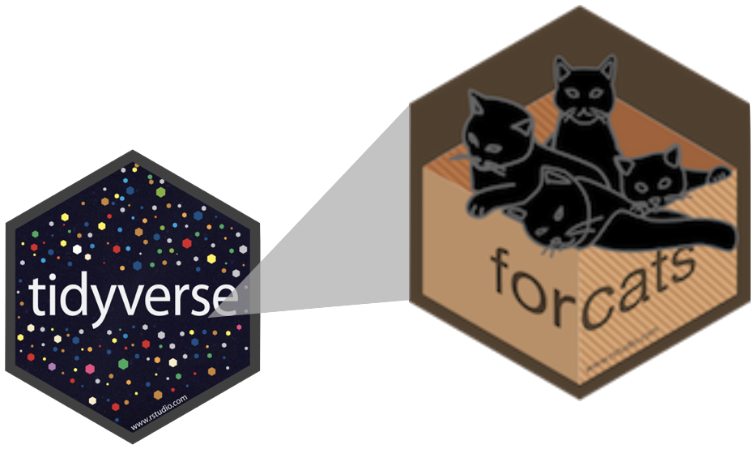
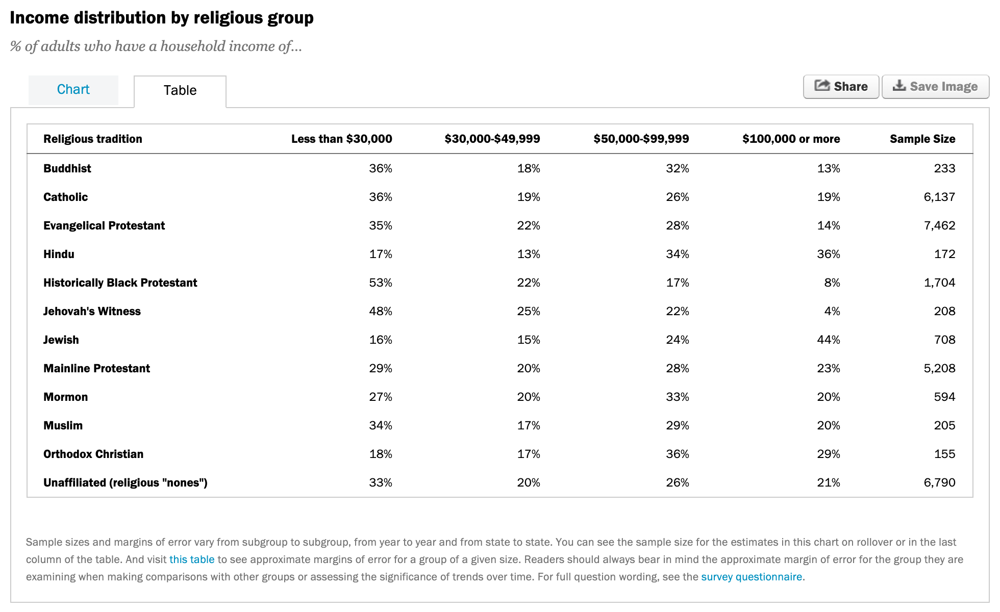

```{r child = "../setup.Rmd"}
```

```{r packages, echo=FALSE, message=FALSE, warning=FALSE}
library(tidyverse)
library(DT)
library(scales)
```

class: middle

# Why should you care about data types?

---

## Example: Cat lovers

A survey asked respondents their name and number of cats. The instructions said to enter the number of cats as a numerical value.

```{r message=FALSE}
cat_lovers <- read_csv("data/cat-lovers.csv")
```

```{r echo=FALSE}
cat_lovers
```

---

## Oh why won't you work?!

```{r}
cat_lovers %>%
  summarise(mean_cats = mean(number_of_cats))
```

---

```{r eval=FALSE}
?mean
```

```{r echo=FALSE, caption="Help for mean", out.width="75%"}
knitr::include_graphics("img/mean-help.png")
```

---

## Oh why won't you still work??!!

```{r}
cat_lovers %>%
  summarise(mean_cats = mean(number_of_cats, na.rm = TRUE))
```

---

## Take a breath and look at your data

.question[
What is the type of the `number_of_cats` variable?
]

```{r}
glimpse(cat_lovers)
```

---

## Let's take another look

.small[
```{r echo=FALSE}
cat_DT <- cat_lovers %>%
  datatable()

widgetframe::frameWidget(cat_DT)
```
]

---

## Sometimes you might need to babysit your respondents

.midi[
```{r}
cat_lovers %>%
  mutate(number_of_cats = case_when(
    name == "Ginger Clark" ~ 2,
    name == "Doug Bass"    ~ 3,
    TRUE                   ~ as.numeric(number_of_cats)
  )) %>%
  summarise(mean_cats = mean(number_of_cats))
```
]

---

## Always you need to respect data types

```{r}
cat_lovers %>%
  mutate(
    number_of_cats = case_when(
      name == "Ginger Clark" ~ "2",
      name == "Doug Bass"    ~ "3",
      TRUE                   ~ number_of_cats
    ),
    number_of_cats = as.numeric(number_of_cats)
  ) %>%
  summarise(mean_cats = mean(number_of_cats))
```

---

## Now that we know what we're doing...

```{r}
cat_lovers <- cat_lovers %>% #<<
  mutate(
    number_of_cats = case_when(
      name == "Ginger Clark" ~ "2",
      name == "Doug Bass"    ~ "3",
      TRUE                   ~ number_of_cats
    ),
    number_of_cats = as.numeric(number_of_cats)
  )
```

---

## Moral of the story

- If your data does not behave how you expect it to, type coercion upon reading in the data might be the reason.
- Go in and investigate your data, apply the fix, *save your data*, live happily ever after.

---

class: middle

.hand[.light-blue[now that we have a good motivation for]]  
.hand[.light-blue[learning about data types in R]]

<br>

.large[
.hand[.light-blue[let's learn about data types in R!]]
]

---

class: middle

# Data types

---

## Data types in R

- **logical**
- **double**
- **integer**
- **character**
- and some more, but we won't be focusing on those

---

## Logical & character

.pull-left[
**logical** - boolean values `TRUE` and `FALSE`

```{r}
typeof(TRUE)
```
]
.pull-right[
**character** - character strings

```{r}
typeof("hello")
```
]

---

## Double & integer

.pull-left[
**double** - floating point numerical values (default numerical type)

```{r}
typeof(1.335)
typeof(7)
```
]
.pull-right[
**integer** - integer numerical values (indicated with an `L`)

```{r}
typeof(7L)
typeof(1:3)
```
]

---

## Concatenation

Vectors can be constructed using the `c()` function.

```{r}
c(1, 2, 3)
c("Hello", "World!")
c(c("hi", "hello"), c("bye", "jello"))
```

---

## Converting between types

.hand[with intention...]

.pull-left[
```{r}
x <- 1:3
x
typeof(x)
```
]
--
.pull-right[
```{r}
y <- as.character(x)
y
typeof(y)
```
]

---

## Converting between types

.hand[with intention...]

.pull-left[
```{r}
x <- c(TRUE, FALSE)
x
typeof(x)
```
]
--
.pull-right[
```{r}
y <- as.numeric(x)
y
typeof(y)
```
]

---

## Converting between types

.hand[without intention...]

R will happily convert between various types without complaint when different types of data are concatenated in a vector, and that's not always a great thing!

.pull-left[
```{r}
c(1, "Hello")
c(FALSE, 3L)
```
]
--
.pull-right[
```{r}
c(1.2, 3L)
c(2L, "two")
```
]

---

## Explicit vs. implicit coercion

Let's give formal names to what we've seen so far:

--
- **Explicit coercion** is when you call a function like `as.logical()`, `as.numeric()`, `as.integer()`, `as.double()`, or `as.character()`


--
- **Implicit coercion** happens when you use a vector in a specific context that expects a certain type of vector

---

.midi[
.your-turn[
### .hand[Your turn!]

- Assignment on ECLearn > `in-class exercise, data types and recoding` > accept assignment, open `type-coercion.Rmd` and knit.
- What is the type of the given vectors? First, guess. Then, try it out in R by removing the comment symbol (`#`). 
If your guess was correct, great! If not, discuss why they have that type.
]
]

--

.small[
**Example:** Suppose we want to know the type of `c(1, "a")`. First, I'd look at: 

.pull-left[
```{r}
typeof(1)
```
]
.pull-right[
```{r}
typeof("a")
```
]

and make a guess based on these. Then finally I'd check:
.pull-left[
```{r}
typeof(c(1, "a"))
```
]
]

---

class: middle

# Special values

---

## Special values

- `NA`: Not available
- `NaN`: Not a number
- `Inf`: Positive infinity
- `-Inf`: Negative infinity

--

.pull-left[
```{r}
pi / 0
0 / 0
```
]
.pull-right[
```{r}
1/0 - 1/0
1/0 + 1/0
```
]

---

## `NA`s are special

```{r}
x <- c(1, 2, 3, 4, NA)
```

```{r}
mean(x)
mean(x, na.rm = TRUE)
summary(x)
```

---

## `NA`s are logical

R uses `NA` to represent missing values in its data structures.

```{r}
typeof(NA)
```

---

## Mental model for `NA`s

- Unlike `NaN`, `NA`s are genuinely unknown values
- But that doesn't mean they can't function in a logical way
- Let's think about why `NA`s are logical...

--

.question[
Why do the following give different answers?
]
.pull-left[
```{r}
# TRUE or NA
TRUE | NA
```
]
.pull-right[
```{r}
# FALSE or NA
FALSE | NA
```
]

$\rightarrow$ See next slide for answers...

---

- `NA` is unknown, so it could be `TRUE` or `FALSE`

.pull-left[
.midi[
- `TRUE | NA`
```{r}
TRUE | TRUE  # if NA was TRUE
TRUE | FALSE # if NA was FALSE
```
]
]
.pull-right[
.midi[
- `FALSE | NA`
```{r}
FALSE | TRUE  # if NA was TRUE
FALSE | FALSE # if NA was FALSE
```
]
]

- Doesn't make sense for mathematical operations 
- Makes sense in the context of missing data


---


class: middle

# Data classes


---

## Data classes

We talked about *types* so far, next we'll introduce the concept of *classes*

- Vectors are like Lego building blocks

--
- We stick them together to build more complicated constructs, e.g. *representations of data*

--
- The **class** attribute relates to the S3 class of an object which determines its behavior
- You don't need to worry about what S3 classes really mean, but you can read more about it [here](https://adv-r.hadley.nz/s3.html#s3-classes) if you're curious

--
- Examples: factors, dates, and data frames

---

## Factors

R uses factors to handle categorical variables, variables that have a fixed and known set of possible values

```{r}
x <- factor(c("BS", "MS", "PhD", "MS"))
x
```

--

.pull-left[
```{r}
typeof(x)
```
]
.pull-right[
```{r}
class(x)
```
]


---

## More on factors

We can think of factors like character (level labels) and an integer (level numbers) glued together

```{r}
glimpse(x)
as.integer(x)
```

---

## Dates

```{r date of today}
y <- as.Date("2021-03-02")
y
typeof(y)
class(y)
```

---

## More on dates

We can think of dates like an integer (the number of days since the origin, 1 Jan 1970) and an integer (the origin) glued together

```{r}
as.integer(y)
as.integer(y) / 365.25 # roughly 51 yrs
```

---

## Data frames

We can think of data frames like like vectors of equal length glued together

```{r}
df <- data.frame(x = 1:2, y = 3:4)
df
```

.pull-left[
```{r}
typeof(df)
```
]
.pull-right[
```{r}
class(df)
```
]

---

## Lists

Lists are a generic vector container vectors of any type can go in them

```{r}
l <- list(
  x = 1:4,
  y = c("hi", "hello", "jello"),
  z = c(TRUE, FALSE)
)
l
```

---

## Lists and data frames

- A data frame is a special list containing vectors of equal length
- When we use the `pull()` function, we extract a vector from the data frame

```{r}
df

df %>%
  pull(y)
```


---

class: middle

# Working with factors

---

```{r include=FALSE}
cat_lovers <- read_csv("data/cat-lovers.csv")
```

## Read data in as character strings

```{r}
glimpse(cat_lovers)
```

---

## But coerce when plotting

```{r out.width="60%"}
ggplot(cat_lovers, mapping = aes(x = handedness)) +
  geom_bar()
```

---

## Use forcats to manipulate factors

```{r out.width="55%"}
cat_lovers %>%
  mutate(handedness = fct_infreq(handedness)) %>% #<<
  ggplot(mapping = aes(x = handedness)) +
  geom_bar()
```

---

## Come for the functionality

.pull-left[
... stay for the logo
]
.pull-right[
```{r echo=FALSE, out.width="70%"}

```
]

.pull-left-wide[
- Factors are useful when you have true categorical data and you want to override the ordering of character vectors to improve display
- They are also useful in modeling scenarios
- The **forcats** package provides a suite of useful tools that solve common problems with factors
]

---

.small[
.your-turn[
### .hand[Your turn!]

- Assignment on ECLearn > `in-class exercise, data types and recoding` > accept assignment, open `hotels-forcats.Rmd` > knit.
- Recreate the x-axis of the following plot. 
- **Stretch goal:** Recreate the y-axis.
]
]

```{r echo=FALSE, out.width="90%", fig.asp=0.3}
hotels <- readr::read_csv("https://raw.githubusercontent.com/rfordatascience/tidytuesday/master/data/2020/2020-02-11/hotels.csv")
hotels %>%
  mutate(arrival_date_month = fct_relevel(arrival_date_month, month.name)) %>%
  group_by(hotel, arrival_date_month) %>%   # group by hotel type and arrival month
  summarise(mean_adr = mean(adr)) %>%       # calculate mean_adr for each group
  ggplot(aes(
    x = arrival_date_month,
    y = mean_adr,                           # y-axis is the mean_adr calculated above
    group = hotel,                          # group lines by hotel type
    color = hotel)                          # and color by hotel type
  ) +
  geom_line() +                             # use lines to represent data
  scale_y_continuous(labels = label_dollar()) +
  theme_minimal() +                         # use a minimal theme
  labs(x = "Arrival month",                 # customize labels
       y = "Mean ADR (average daily rate)",
       title = "Comparison of resort and city hotel prices across months",
       subtitle = "Resort hotel prices soar in the summer while city hotel prices remain\nrelatively constant throughout the year",
       color = "Hotel type") + 
  theme(axis.text.x = 
          element_text(
            angle=90, # text at 90 degrees
            hjust=1,  # right justified
            vjust=0.5 # centered on the tick marks
          )
  )
```
???
hotels %>%
mutate(arrival_date_month = fct_relevel(arrival_date_month, month.name)) %>%
group_by(hotel, arrival_date_month) %>%   # group by hotel type and arrival month
summarise(mean_adr = mean(adr)) %>%       # calculate mean_adr for each group
ggplot(aes(
x = arrival_date_month,
y = mean_adr,                           # y-axis is the mean_adr calculated above
group = hotel,                          # group lines by hotel type
color = hotel)                          # and color by hotel type
) +
geom_line() +                             # use lines to represent data
scale_y_continuous(labels = label_dollar()) +
theme_minimal() +                         # use a minimal theme
labs(x = "Arrival month",                 # customize labels
y = "Mean ADR (average daily rate)",
title = "Comparison of resort and city hotel prices across months",
subtitle = "Resort hotel prices soar in the summer while city hotel prices remain\nrelatively constant throughout the year",
color = "Hotel type") +
theme(axis.text.x = 
          element_text(
            angle=90, # text at 90 degrees
            hjust=1,  # right justified
            vjust=0.5 # centered on the tick marks
          )
  )
---

class: middle

# Working with dates

---

## Make a date

.pull-left[
```{r echo=FALSE, out.width="65%", fig.align="center"}
knitr::include_graphics("img/lubridate-not-part-of-tidyverse.png")
```
]
.pull-right[
- **lubridate** is the tidyverse-friendly package that makes dealing with dates a little easier
- It's not one of the *core* tidyverse packages, hence it's installed with `install.packages("tidyverse)` but it's not loaded with it, and needs to be explicitly loaded with `library(lubridate)`
]

---

background-image: url("img/lubridate.png")
background-size: contain

---


class: middle

.hand[.light-blue[
we're just going to scratch the surface of working with dates in R here...
]]

---

.question[
Calculate and visualize the number of bookings on any given arrival date.
]

```{r}
hotels %>%
  select(starts_with("arrival_"))
```

---

## Step 1. Construct dates

.midi[
```{r output.lines=7}
library(glue)

hotels %>%
  mutate(
    arrival_date = glue("{arrival_date_year} {arrival_date_month} {arrival_date_day_of_month}") #<<
  ) %>% 
  relocate(arrival_date) # moves column to the front
```
]

---

background-image: url("img/dplyr_relocate.png")
background-size: contain


---


## Step 2. Count bookings per date

.midi[
```{r}
hotels %>%
  mutate(arrival_date = glue("{arrival_date_year} {arrival_date_month} {arrival_date_day_of_month}")) %>%
  count(arrival_date)
```
]

---

## Step 3. Visualize bookings per date

.midi[
```{r out.width="80%", fig.asp = 0.4}
hotels %>%
  mutate(arrival_date = glue("{arrival_date_year} {arrival_date_month} {arrival_date_day_of_month}")) %>%
  count(arrival_date) %>%
  ggplot(aes(x = arrival_date, y = n, group = 1)) +
  geom_line()
```
]

---

.hand[zooming in a bit...]

.question[
Why does the plot start with August when we know our data start in July? And why does 10 August come after 1 August?
]

.midi[
```{r out.width="80%", echo=FALSE, fig.asp = 0.4}
hotels %>%
  mutate(arrival_date = glue("{arrival_date_year} {arrival_date_month} {arrival_date_day_of_month}")) %>%
  count(arrival_date) %>%
  slice(1:7) %>%
  ggplot(aes(x = arrival_date, y = n, group = 1)) +
  geom_line() + 
  theme(axis.text.x = element_text(angle=45,vjust=1, hjust=1))
```
]

---

## Step 1. *REVISED* Construct dates "as dates"

.midi[
```{r output.lines=7}
library(lubridate)

hotels %>%
  mutate(
    arrival_date = lubridate::ymd( #<<
      glue("{arrival_date_year} {arrival_date_month} {arrival_date_day_of_month}")
    ) 
  ) %>% 
  relocate(arrival_date)
```
]

---

background-image: url("img/lubridate_ymd.png")
background-size: contain

---


## Step 2. Count bookings per date

.midi[
```{r}
hotels %>%
  mutate(arrival_date = lubridate::ymd(
    glue("{arrival_date_year} {arrival_date_month} {arrival_date_day_of_month}")
  )) %>% 
  count(arrival_date)
```
]

---

## Step 3a. Visualize bookings per date

.midi[
```{r out.width="80%", fig.asp = 0.4}
hotels %>%
  mutate(arrival_date = lubridate::ymd(
    glue("{arrival_date_year} {arrival_date_month} {arrival_date_day_of_month}")
  )) %>% 
  count(arrival_date) %>%
  ggplot(aes(x = arrival_date, y = n)) +
  geom_line()
```
]

---

## Step 3b. Visualize using a smooth curve

.midi[
```{r out.width="80%", fig.asp = 0.4, message = FALSE}
hotels %>%
  mutate(arrival_date = lubridate::ymd(
    glue("{arrival_date_year} {arrival_date_month} {arrival_date_day_of_month}")
  )) %>% 
  count(arrival_date) %>%
  ggplot(aes(x = arrival_date, y = n)) +
  geom_smooth() #<<
```
]


---

class: middle

# Case study: Religion and income

---

```{r echo=FALSE, out.width="75%"}

```

.footnote[
Source: [pewforum.org/religious-landscape-study/income-distribution](https://www.pewforum.org/religious-landscape-study/income-distribution/), Retrieved 14 April, 2020
]

---

## Read data 

```{r}
library(readxl)
rel_inc <- read_excel("data/relig-income.xlsx")
```


```{r}
rel_inc
```


---

## Rename columns

.midi[
```{r}
rel_inc %>%
  rename( 
    religion = `Religious tradition`, 
    n = `Sample Size` 
  ) 
```
]

---

.question[
If we want a new variable called `income` with levels such as "Less than $30,000", "$30,000-$49,999", ... etc. which function should we use?
]

```{r echo=FALSE}
rel_inc %>%
  rename(
    religion = `Religious tradition`,
    n = `Sample Size`
  ) %>%
  pivot_longer( 
    # data lives in all columns EXCEPT `religion` and `n`
    cols = -c(religion, n),    
    names_to = "income",  
    values_to = "proportion" 
  ) %>% 
  print(n = 15)
```

---

## Pivot longer

.midi[
```{r}
rel_inc %>%
  rename(
    religion = `Religious tradition`,
    n = `Sample Size`
  ) %>%
  pivot_longer( 
    # data lives in all columns EXCEPT `religion` and `n`
    cols = -c(religion, n),   
    names_to = "income",  
    values_to = "proportion" 
  ) 
```
]

---

## Calculate frequencies

.midi[
```{r}
rel_inc %>%
  rename(
    religion = `Religious tradition`,
    n = `Sample Size`
  ) %>%
  pivot_longer(
    cols = -c(religion, n), 
    names_to = "income", 
    values_to = "proportion"
  ) %>%
  mutate(frequency = round(proportion * n)) 
```
]

---

## Save data

```{r}
rel_inc_long <- rel_inc %>% 
  rename(
    religion = `Religious tradition`,
    n = `Sample Size`
  ) %>%
  pivot_longer(
    cols = -c(religion, n), 
    names_to = "income", 
    values_to = "proportion"
  ) %>%
  mutate(frequency = round(proportion * n))
```

---

## Barplot

```{r out.width="65%"}
ggplot(rel_inc_long, aes(y = religion, x = frequency)) +
  geom_col()
```

---

## Recode religion

.panelset[

.panel[.panel-name[Recode]
```{r}
rel_inc_long <- rel_inc_long %>%
  mutate(religion = case_when(
    religion == "Evangelical Protestant"           ~ "Ev. Protestant",
    religion == "Historically Black Protestant"    ~ "Hist. Black Protestant",
    religion == 'Unaffiliated (religious "nones")' ~ "Unaffiliated",
    TRUE                                           ~ religion
  ))
```
]

.panel[.panel-name[Plot]
```{r out.width="65%", echo=FALSE}
ggplot(rel_inc_long, aes(y = religion, x = frequency)) + 
  geom_col()
```
]

]

---

## Reverse religion order

.panelset[

.panel[.panel-name[Recode]
```{r}
rel_inc_long <- rel_inc_long %>%
  mutate(religion = fct_rev(religion)) 
```
]

.panel[.panel-name[Plot]
```{r out.width="65%", echo=FALSE}
ggplot(rel_inc_long, aes(y = religion, x = frequency)) + 
  geom_col()
```
]

]

---

## Add income

.panelset[

.panel[.panel-name[Plot]
```{r rel-income, out.width = "65%", echo = FALSE}
ggplot(rel_inc_long, aes(y = religion, x = frequency, fill = income)) + 
  geom_col() 
```
]

.panel[.panel-name[Code]
```{r ref.label = "rel-income", fig.show = "hide"}
```
]

]

---

## Fill bars

.panelset[

.panel[.panel-name[Plot]
```{r rel-income-fill, out.width = "65%", echo = FALSE}
ggplot(rel_inc_long, aes(y = religion, x = frequency, fill = income)) +
  geom_col(position = "fill")
```
]

.panel[.panel-name[Code]
```{r ref.label = "rel-income-fill", fig.show = "hide"}
```
]

]

---

## Change colors

.panelset[

.panel[.panel-name[Plot]
```{r rel-income-fill-viridis, out.width = "65%", echo = FALSE}
ggplot(rel_inc_long, aes(y = religion, x = frequency, fill = income)) +
  geom_col(position = "fill") +
  scale_fill_viridis_d()
```
]

.panel[.panel-name[Code]
```{r ref.label = "rel-income-fill-viridis", fig.show = "hide"}
```
]

]

---


## Change theme

.panelset[

.panel[.panel-name[Plot]
```{r rel-income-fill-viridis-minimal, out.width = "65%", echo = FALSE}
ggplot(rel_inc_long, aes(y = religion, x = frequency, fill = income)) +
  geom_col(position = "fill") +
  scale_fill_viridis_d() +
  theme_minimal() 
```
]

.panel[.panel-name[Code]
```{r ref.label = "rel-income-fill-viridis-minimal", fig.show = "hide"}
```
]

]

---

## Move legend to the bottom

.panelset[

.panel[.panel-name[Plot]
```{r bottom-legend, out.width = "65%", echo = FALSE}
ggplot(rel_inc_long, aes(y = religion, x = frequency, fill = income)) +
  geom_col(position = "fill") +
  scale_fill_viridis_d() +
  theme_minimal() +
  theme(legend.position = "bottom")
```
]

.panel[.panel-name[Code]
```{r ref.label = "bottom-legend", fig.show = "hide"}
```
]

]

---

## Legend adjustments

.panelset[

.panel[.panel-name[Plot]
```{r ref.label = "legend-adjust", echo=FALSE, out.width="65%"}
```
]

.panel[.panel-name[Code]
```{r legend-adjust, fig.show="hide"}
ggplot(rel_inc_long, aes(y = religion, x = frequency, fill = income)) +
  geom_col(position = "fill") +
  scale_fill_viridis_d() +
  theme_minimal() +
  theme(legend.position = "bottom") +
  guides(fill = guide_legend(nrow = 2, byrow = TRUE)) 
```
]

]

---

## Fix labels

.panelset[

.panel[.panel-name[Plot]
```{r ref.label = "fix-labels", echo=FALSE, out.width="65%"}
```
]

.panel[.panel-name[Code]
```{r fix-labels, fig.show="hide"}
ggplot(rel_inc_long, aes(y = religion, x = frequency, fill = income)) +
  geom_col(position = "fill") +
  scale_fill_viridis_d() +
  theme_minimal() +
  theme(legend.position = "bottom") +
  guides(fill = guide_legend(nrow = 2, byrow = TRUE)) +
  labs(
    x = "Proportion", y = "", 
    title = "Income distribution by religious group", 
    subtitle = "Source: Pew Research Center, Religious Landscape Study", 
    fill = "Income" 
  )
```
]

]


---

# Attributions

Some of the material in this slide deck was inspired by and/or partially adapted from several open-source data science resources, including

- The [R for Data Science](https://r4ds.had.co.nz/) textbook by Hadley Wickham & Garrett Grolemund [CC BY-NC-ND 3.0 US](https://creativecommons.org/licenses/by-nc-nd/3.0/us/) 
- The [datasciencebox](https://github.com/rstudio-education/datascience-box) by Mine Çetinkaya-Rundel [CC BY-SA 4.0](https://creativecommons.org/licenses/by-sa/4.0/) 
- Artwork by @allison_horst [CC BY-SA 4.1](https://creativecommons.org/licenses/by-sa/4.0/) 

