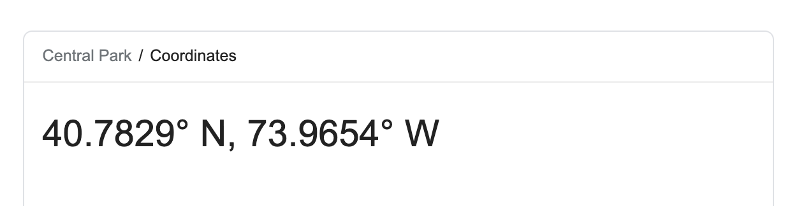

```{r child = "../setup.Rmd"}
```

```{r packages, echo = FALSE, message=FALSE, warning=FALSE}
library(tidyverse)
library(scales)
library(kableExtra)
library(dsbox)
```

class: middle

# Scientific studies

---

## Scientific studies

.pull-left[
**Observational**  
- Collect data in a way that does not interfere with how the data arise ("observe")
- Establish associations
]
.pull-right[
**Experimental**  
- Randomly assign subjects to treatments
- Establish causal connections
]

---

.question[
What type of study is the following, observational or experiment? What does that mean in terms of causal conclusions?

*Researchers studying the relationship between exercising and energy levels asked participants in their study how many times a week they exercise and whether they have high or low energy when they wake up in the morning.*

*Based on responses to the exercise question the researchers grouped people into three categories (no exercise, exercise 1-3 times a week, and exercise more than 3 times a week).* 

*The researchers then compared the proportions of people who said they have high energy in the mornings across the three exercise categories.*
]

---

.question[
What type of study is the following, observational or experiment? What does that mean in terms of causal conclusions?

*Researchers studying the relationship between exercising and energy levels randomly assigned participants in their study into three groups: no exercise, exercise 1-3 times a week, and exercise more than 3 times a week.* 

*After one week, participants were asked whether they have high or low energy when they wake up in the morning.*

*The researchers then compared the proportions of people who said they have high energy in the mornings across the three exercise categories.*
]

---

class: middle

# Case study: Breakfast cereal keeps girls slim

---


.midi[
> *Girls who ate breakfast of any type had a lower average body mass index (BMI), a common obesity gauge, than those who said they didn't. The index was even lower for girls who said they ate cereal for breakfast, according to findings of the study conducted by the Maryland Medical Research Institute with funding from the National Institutes of Health (NIH) and cereal-maker General Mills.* [...]
>
> *The results were gleaned from a larger NIH survey of 2,379 girls in California, Ohio, and Maryland who were tracked between the ages of 9 and 19.* [...]
>
>*As part of the survey, the girls were asked once a year what they had eaten during the previous three days.* [...]
]

.footnote[
Source: [Study: Cereal Keeps Girls Slim](https://www.cbsnews.com/news/study-cereal-keeps-girls-slim/), Retrieved Sep 13, 2018.
]

---

## Explanatory and response variables

- Explanatory variable: Whether the participant ate breakfast or not

- Response variable: BMI of the participant


---

## Three possible explanations

--

1. Eating breakfast causes girls to be slimmer 


--
2. Being slim causes girls to eat breakfast


--
3. A third variable is responsible for both -- a **confounding** variable: an extraneous variable that affects both the explanatory and the response variable, and that makes it seem like there is a relationship between them

---

## Correlation != causation

```{r echo=FALSE, out.height="50%", out.width="80%"}

```

.footnote[
Randall Munroe CC BY-NC 2.5 http://xkcd.com/552/
]

---

## Studies and conclusions

```{r echo=FALSE, out.height="50%", out.width="80%"}

```

---

class: middle

# Case study: Climate change survey

---

## Survey question

>A July 2019 YouGov survey asked 1633 GB and 1333 USA randomly selected adults 
which of the following statements about the global environment best describes 
their view:
>
>- The climate is changing and human activity is mainly responsible  
>- The climate is changing and human activity is partly responsible, together with other factors  
>- The climate is changing but human activity is not responsible at all  
>- The climate is not changing  

---

## Survey data

<br>

.small[
```{r echo=FALSE, message=FALSE}
yougov_climate_table <- read_csv("data/yougov-climate.csv")

response_levels <- names(yougov_climate_table)[-1]

yougov_climate <- yougov_climate_table %>%
  pivot_longer(cols = -country, names_to = "response", values_to = "count") %>%
  uncount(count) %>%
  mutate(response = fct_relevel(response, response_levels))
```

```{r climate-table, echo=FALSE}
table(yougov_climate) %>% 
  stats::addmargins() %>%
  knitr::kable(format = "html", booktabs = TRUE) %>%
  kableExtra::column_spec(column = 2:5, width = "0.5 in")
```
]

.footnote[
Source: [YouGov - International Climate Change Survey](https://d25d2506sfb94s.cloudfront.net/cumulus_uploads/document/epjj0nusce/YouGov%20-%20International%20climate%20change%20survey.pdf)
]

---

.question[
What percent of **all respondents** think the climate is changing and  
human activity is mainly responsible?  
]

.small[
```{r ref.label="climate-table", echo=FALSE}
```
]

--

```{r}
(all <- 1340 / 2966)
```


---

.question[
What percent of **GB respondents** think the climate is changing and  
human activity is mainly responsible?  
]

.small[
```{r ref.label="climate-table", echo=FALSE}
```
]

--

```{r}
(gb <- 833 / 1633)
```

---

.question[
What percent of **US respondents** think the climate is changing and  
human activity is mainly responsible?  
]

.small[
```{r ref.label="climate-table", echo=FALSE}
```
]

--

```{r}
(us <- 507 / 1333)
```

---

.question[
Based on the percentages we calculated, does there appear to be a relationship 
between country and beliefs about climate change? If yes, could there be another variable that explains this relationship?
]

.pull-left[
```{r}
all
gb
us
```
]

---

## Conditional probability

**Notation**: $P(A | B)$: Probability of event A given event B

- What is the probability that it will be unseasonably warm tomorrow?
- What is the probability that it will be unseasonably warm tomorrow, given that it was unseasonably warm today?

---

## Independence

- If knowing event A happened tells you something about event B happening, or vice versa, then events A and B are not independent

- If not, they are said to be independent

- $P(A | B) = P(A)$


---

class: middle

# Simpson's paradox

--

### Or, why I have been emphasizing "adding another variable to the plot"

Case study: Berkeley admission data

---

## Berkeley admission data

- Study carried out by the Graduate Division of the University of California, Berkeley in the early 70’s to evaluate whether there was a gender bias in graduate admissions.
- The data come from six departments. For confidentiality we'll call them A-F. 
- We have information on whether the applicant was male or female and whether they were admitted or rejected. 
- First, we will evaluate whether the percentage of males admitted is indeed higher than females, overall. Next, we will calculate the same percentage for each department.

---

## Data

.pull-left[
```{r message=FALSE, echo=FALSE}
ucbadmit %>%
  print(n = 15)
```
]
.pull-right[
```{r message=FALSE, echo=FALSE}
ucbadmit %>%
  count(gender)

ucbadmit %>%
  count(dept)

ucbadmit %>%
  count(admit)
```
]

---

.question[
What can you say about the overall gender distribution? Hint: Calculate the following probabilities: $P(Admit | Male)$ and $P(Admit | Female)$.
]

```{r}
ucbadmit %>%
  count(gender, admit)
```

---

```{r ucbadmit-overall-prop}
ucbadmit %>%
  count(gender, admit) %>%
  group_by(gender) %>%
  mutate(prop_admit = n / sum(n))
```

- $P(Admit | Female)$ = 0.304
- $P(Admit | Male)$ = 0.445

---

## Overall gender distribution

.panelset[

.panel[.panel-name[Plot]
```{r ref.label="gender-admit", echo = FALSE}
```
]

.panel[.panel-name[Code]
```{r gender-admit, fig.show = "hide"}
ggplot(ucbadmit, aes(y = gender, fill = admit)) +
  geom_bar(position = "fill") + 
  labs(title = "Admit by gender",
       y = NULL, x = NULL)
```
]

]

---

.question[
What can you say about the gender distribution by department ?
]

```{r}
ucbadmit %>%
  count(dept, gender, admit)
```

---

.question[
Let's try again... What can you say about the gender distribution by department?
]

```{r}
ucbadmit %>%
  count(dept, gender, admit) %>%
  pivot_wider(names_from = dept, values_from = n)
```

---

## Gender distribution, by department

.panelset[

.panel[.panel-name[Plot]
```{r ref.label="gender-dept-admit", echo = FALSE}
```
]

.panel[.panel-name[Code]
```{r gender-dept-admit, fig.show = "hide"}
ggplot(ucbadmit, aes(y = gender, fill = admit)) +
  geom_bar(position = "fill") +
  facet_wrap(. ~ dept) +
  scale_x_continuous(labels = label_percent()) +
  labs(title = "Admissions by gender and department",
       x = NULL, y = NULL, fill = NULL) +
  theme(legend.position = "bottom")
```
]

]

---

## Case for gender discrimination?

.pull-left[
```{r ref.label="gender-admit", echo=FALSE, out.width="100%"}
```
]
.pull-right[
```{r ref.label="gender-dept-admit", echo=FALSE, out.width="100%"}
```
]

---

## Closer look at departments

.panelset[

.panel[.panel-name[Output]
```{r ref.label="gender-dept-admit-table", echo = FALSE}
```
]

.panel[.panel-name[Code]
```{r gender-dept-admit-table, eval = FALSE}
ucbadmit %>%
  count(dept, gender, admit) %>%
  group_by(dept, gender) %>%
  mutate(
    n_applied  = sum(n),
    prop_admit = n / n_applied
    ) %>%
  filter(admit == "Admitted") %>%
  rename(n_admitted = n) %>%
  select(-admit) %>%
  print(n = 12)
```
]

]

---

class: middle

# Simpson's paradox

---

## Relationship between two variables

.pull-left[
```{r echo=FALSE, message=FALSE}
df <- tribble(
  ~x, ~y, ~z,
  2,   4,  "A",
  3,   3,  "A",
  4,   2,  "A",
  5,   1,  "A",
  6,   11, "B",
  7,   10, "B",
  8,   9,  "B",
  9,   8,  "B"
)
df
```
]
.pull-right[
```{r echo=FALSE, out.width="100%"}
ggplot(df) +
  geom_point(aes(x = x, y = y), color = "darkgray", size = 5) +
  theme_minimal()
```
]

---

## Relationship between two variables

.pull-left[
```{r echo=FALSE, message=FALSE}
df
```
]
.pull-right[
```{r echo=FALSE, out.width="100%"}
ggplot(data = df) +
  geom_point(aes(x = x, y = y), color = "darkgray", size = 5) +
  geom_smooth(aes(x = x, y = x), color = "darkgray") +
  theme_minimal()
```
]

---

## Considering a third variable

.pull-left[
```{r echo=FALSE, message=FALSE}
df
```
]
.pull-right[
```{r echo=FALSE, out.width="100%"}
ggplot(data = df) +
  geom_point(aes(x = x, y = y, color = z), size = 5) +
  geom_smooth(aes(x = x, y = x), method = "lm", color = "darkgray") +
  theme_minimal()
```
]

---

## Relationship between three variables

.pull-left[
```{r echo=FALSE, message=FALSE}
df
```
]
.pull-right[
```{r echo=FALSE, out.width="100%"}
ggplot(data = df) +
  geom_point(aes(x = x, y = y, color = z), size = 5) +
  geom_smooth(aes(x = x, y = x), method = "lm", color = "darkgray") +
  geom_smooth(aes(x = x, y = y, color = z), method = "lm") +
  theme_minimal()
```
]

---

## Simpson's paradox

- Not considering an important variable when studying a relationship can result in **Simpson's paradox**
- Simpson's paradox illustrates the effect that omission of an explanatory variable can have on the measure of association between another explanatory variable and a response variable
- The inclusion of a third variable in the analysis can change the apparent relationship between the other two variables

---

class: middle

# Aside: `group_by()` and `count()`

---

## What does group_by() do?

`group_by()` takes an existing data frame and converts it into a grouped data frame where subsequent operations are performed "once per group"

.pull-left[
```{r}
ucbadmit
```
]
.pull-right[
```{r}
ucbadmit %>% 
  group_by(gender)
```
]

---

## What does group_by() not do?

`group_by()` does not sort the data, `arrange()` does

.pull-left[
```{r}
ucbadmit %>% 
  group_by(gender)
```
]
.pull-right[
```{r}
ucbadmit %>% 
  arrange(gender)
```
]

---

## What does group_by() not do?

`group_by()` does not create frequency tables, `count()` does

.pull-left[
```{r}
ucbadmit %>% 
  group_by(gender)
```
]
.pull-right[
```{r}
ucbadmit %>% 
  count(gender)
```
]

---

## Undo grouping with ungroup()

.pull-left[
```{r}
ucbadmit %>%
  count(gender, admit) %>%
  group_by(gender) %>%
  mutate(prop_admit = n / sum(n)) %>%
  select(gender, prop_admit)
```
]
.pull-right[
```{r}
ucbadmit %>%
  count(gender, admit) %>%
  group_by(gender) %>%
  mutate(prop_admit = n / sum(n)) %>%
  select(gender, prop_admit) %>%
  ungroup()
```
]

---

## count() is a short-hand

`count()` is a short-hand for `group_by()` and then `summarize()` to count the number of observations in each group

.pull-left[
```{r}
ucbadmit %>%
  group_by(gender) %>%
  summarize(n = n()) 
```
]
.pull-right[
```{r}
ucbadmit %>%
  count(gender)
```
]

---

## count can take multiple arguments

.pull-left[
```{r}
ucbadmit %>%
  group_by(gender, admit) %>%
  summarize(n = n()) 
```
]
.pull-right[
```{r}
ucbadmit %>%
  count(gender, admit)
```
]

---

## `summarize()` after `group_by()`

- `count()` ungroups after itself
- `summarize()` peels off one layer of grouping by default, or you can specify a different behavior


```{r message=TRUE}
ucbadmit %>%
  group_by(gender, admit) %>%
  summarize(n = n()) 
```


---

class: middle

# What's in a data analysis?

---

## Five core activities of data analysis

1. Stating and refining the question
1. Exploring the data
1. Building formal statistical models
1. Interpreting the results
1. Communicating the results

.footnote[
Roger D. Peng and Elizabeth Matsui. ["The Art of Data Science."](https://bookdown.org/rdpeng/artofdatascience/) 
]

---

class: middle

# Stating and refining the question

---

## Six types of questions

1. **Descriptive:** summarize a characteristic of a set of data
1. **Exploratory:** analyze to see if there are patterns, trends, or relationships between variables (hypothesis generating)
1. **Inferential:** analyze patterns, trends, or relationships in representative data from a population
1. **Predictive:** make predictions for individuals or groups of individuals
1. **Causal:** whether changing one factor will change another factor, on average, in a population
1. **Mechanistic:** explore "how" as opposed to whether

.footnote[
Jeffery T. Leek and Roger D. Peng. "What is the question?." Science 347.6228 (2015): 1314-1315.
]

---

## Ex: COVID-19 and Vitamin D

1. **Descriptive:** frequency of hospitalizations due to COVID-19 in a set of data collected from a group of individuals
--

1. **Exploratory:** examine relationships between a range of dietary factors and COVID-19 hospitalizations
--

1. **Inferential:** examine whether any relationship between taking Vitamin D supplements and COVID-19 hospitalizations found in the sample hold for the population at large

--
1. **Predictive:** what types of people will take Vitamin D supplements during the next year

--
1. **Causal:** whether people with COVID-19 who were randomly assigned to take Vitamin D supplements or those who were not are hospitalized

--
1. **Mechanistic:** how increased vitamin D intake leads to a reduction in the number of viral illnesses

---

## Questions to data science problems

- Do you have appropriate data to answer your question?
- Do you have information on confounding variables?
- Was the data you're working with collected in a way that introduces bias?

--

.question[
Suppose I want to estimate the average number of children in households in Boston. I conduct a survey at an elementary school in Boston and ask students at this elementary school how many children, including themselves, live in their house. Then, I take the average of the responses. Is this a biased or an unbiased estimate of the number of children in households in Boston? If biased, will the value be an overestimate or underestimate?
]

---

class: middle

# Exploratory data analysis

---

## Checklist

- Formulate your question
- Read in your data
- Check the dimensions
- Look at the top and the bottom of your data
- Validate with at least one external data source
- Make a plot
- Try the easy solution first

---

## Formulate your question

- Consider scope:
  - Are air pollution levels higher on the east coast than on the west coast?
  - Are hourly ozone levels on average higher in New York City than they are in Los Angeles?
  - Do counties in the eastern United States have higher ozone levels than counties in the western United States?
- Most importantly: "Do I have the right data to answer this question?"

---

## Read in your data

- Place your data in a folder called `data`
- Read it into R with `read_csv()` or friends (`read_delim()`, `read_excel()`, etc.)

```{r}
library(readxl)
fav_food <- read_excel("data/favourite-food.xlsx")
fav_food
```

---

## `clean_names()`

If the variable names are formatted in a silly way, use `janitor::clean_names()`

```{r message=FALSE, warning=FALSE}
library(janitor)
fav_food %>% clean_names()  
```

---

## Case study: NYC Squirrels!

- [The Squirrel Census](https://www.thesquirrelcensus.com/) is a multimedia science, design, and storytelling project focusing on the Eastern gray (*Sciurus carolinensis*). They count squirrels and present their findings to the public.
- This table contains squirrel data for each of the 3,023 sightings, including location coordinates, age, primary and secondary fur color, elevation, activities, communications, and interactions between squirrels and with humans.

```{r}
# remotes::install_github("mine-cetinkaya-rundel/nycsquirrels18")
library(nycsquirrels18)
```

---

## Locate the `codebook`, if available. 

[mine-cetinkaya-rundel.github.io/nycsquirrels18/reference/squirrels.html](https://mine-cetinkaya-rundel.github.io/nycsquirrels18/reference/squirrels.html)

<br><br>

--

## Check the dimensions

```{r}
dim(squirrels)
```

---

## Look at the top...

```{r}
squirrels %>% head()
```

---

## ...and the bottom

.small[
```{r}
squirrels %>% tail()
```
]

---

## Validate with at least one external data source

.pull-left[
```{r echo=FALSE}
squirrels %>%
  select(long, lat) %>%
  print(n = 15)
```
]
.pull-right[
```{r echo=FALSE, out.width="100%"}

```
]

---

## Make a plot

```{r out.width="45%"}
ggplot(squirrels, aes(x = long, y = lat)) +
  geom_point(alpha = 0.2)
```

--

.pull-left-wide[
**Hypothesis:** There will be a higher density of sightings on the perimeter than inside the park.
]

---

## Try the easy solution first

.panelset[

.panel[.panel-name[Plot]
```{r ref.label="easy-solution", echo = FALSE}
```
]

.panel[.panel-name[Code]
```{r easy-solution, fig.show = "hide"}
squirrels <- squirrels %>%
  separate(hectare, into = c("NS", "EW"), sep = 2, remove = FALSE) %>%
  mutate(where = if_else(NS %in% c("01", "42") | EW %in% c("A", "I"), "perimeter", "inside")) 

ggplot(squirrels, aes(x = long, y = lat, color = where)) +
  geom_point(alpha = 0.2)
```
]

]

---

## Then go deeper...

.panelset[

.panel[.panel-name[Plot]
```{r ref.label="hex-plot", echo = FALSE}
```
]

.panel[.panel-name[Code]
```{r hex-plot, fig.show = "hide"}
hectare_counts <- squirrels %>%
  group_by(hectare) %>%
  summarise(n = n()) 

hectare_centroids <- squirrels %>%
  group_by(hectare) %>%
  summarise(
    centroid_x = mean(long),
    centroid_y = mean(lat)
  )

squirrels %>%
  left_join(hectare_counts, by = "hectare") %>%
  left_join(hectare_centroids, by = "hectare") %>%
  ggplot(aes(x = centroid_x, y = centroid_y, color = n)) +
  geom_hex()
```
]

]

---

## The squirrel is staring at me!

```{r}
squirrels %>%
  filter(str_detect(other_interactions, "star")) %>%
  select(shift, age, other_interactions)
```

---

## Communicating for your audience

- Avoid: Jargon, uninterpreted results, lengthy output
- Pay attention to: Organization, presentation, flow
- Don't forget about: Code style, coding best practices, meaningful commits
- Be open to: Suggestions, feedback, taking (calculated) risks

---

# Attributions

Some of the material in this slide deck was inspired by and/or partially adapted from several open-source data science resources, including

- The [datasciencebox](https://github.com/rstudio-education/datascience-box) by Mine Çetinkaya-Rundel [CC BY-SA 4.0](https://creativecommons.org/licenses/by-sa/4.0/) 
- The [R for Data Science](https://r4ds.had.co.nz/) textbook by Hadley Wickham & Garrett Grolemund [CC BY-NC-ND 3.0 US](https://creativecommons.org/licenses/by-nc-nd/3.0/us/) 
- Artwork by @allison_horst [CC BY-SA 4.1](https://creativecommons.org/licenses/by-sa/4.0/) 


