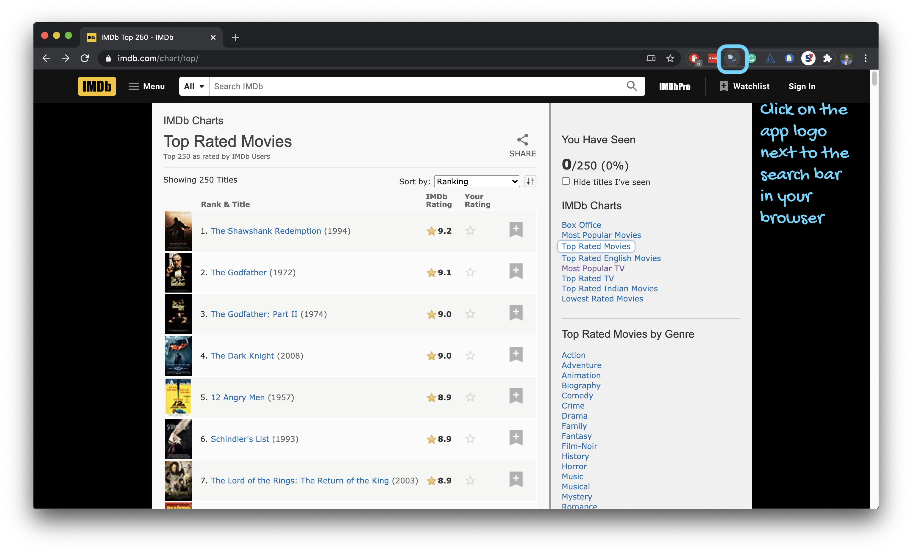
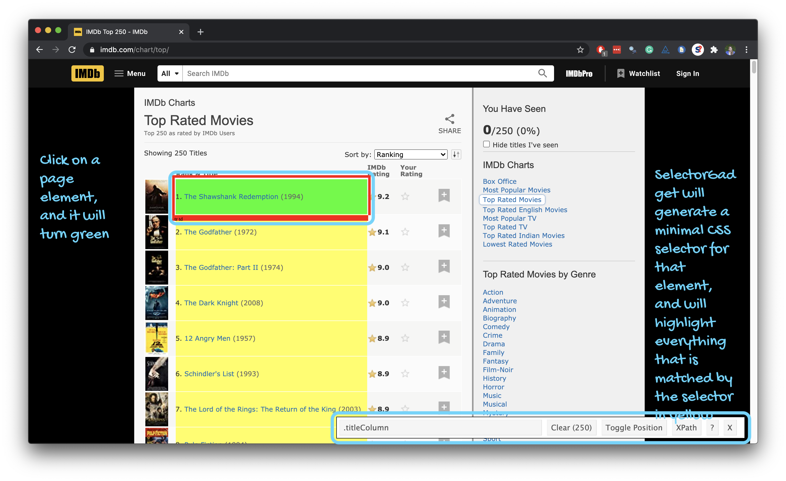
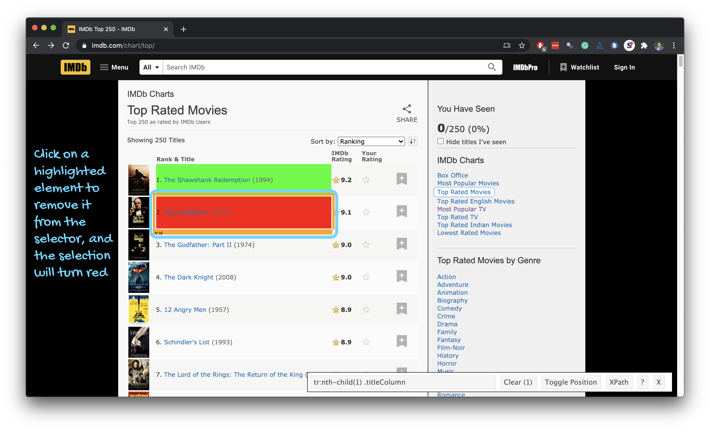
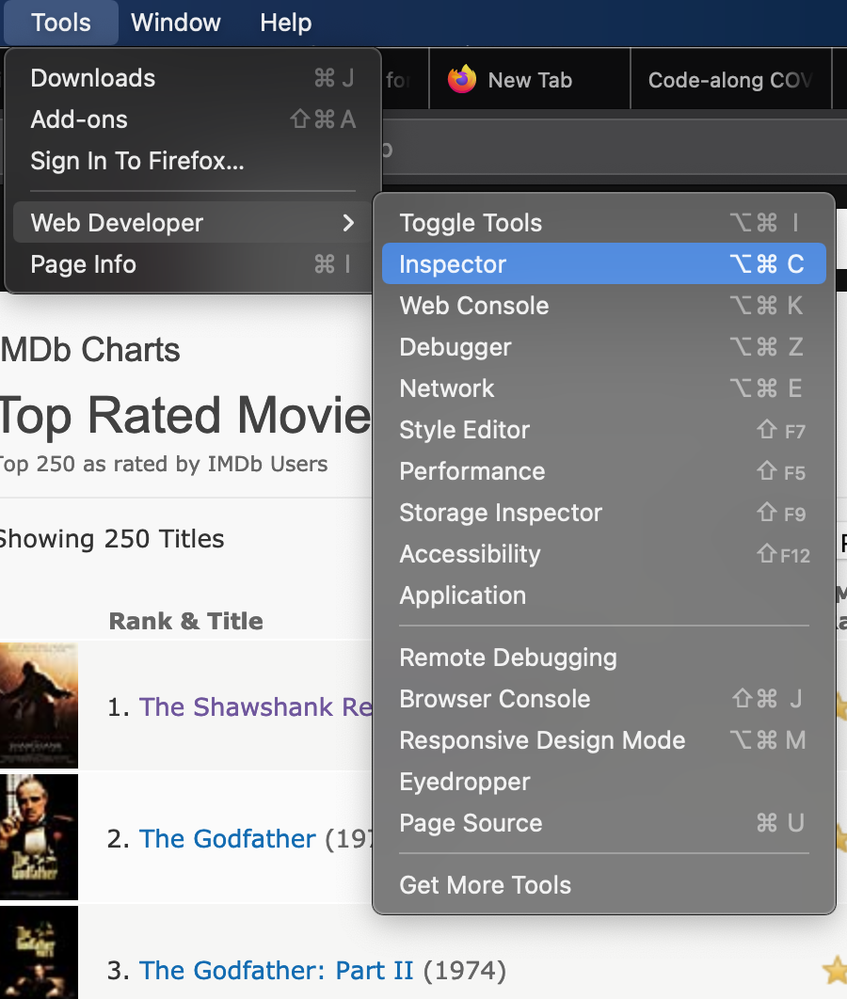
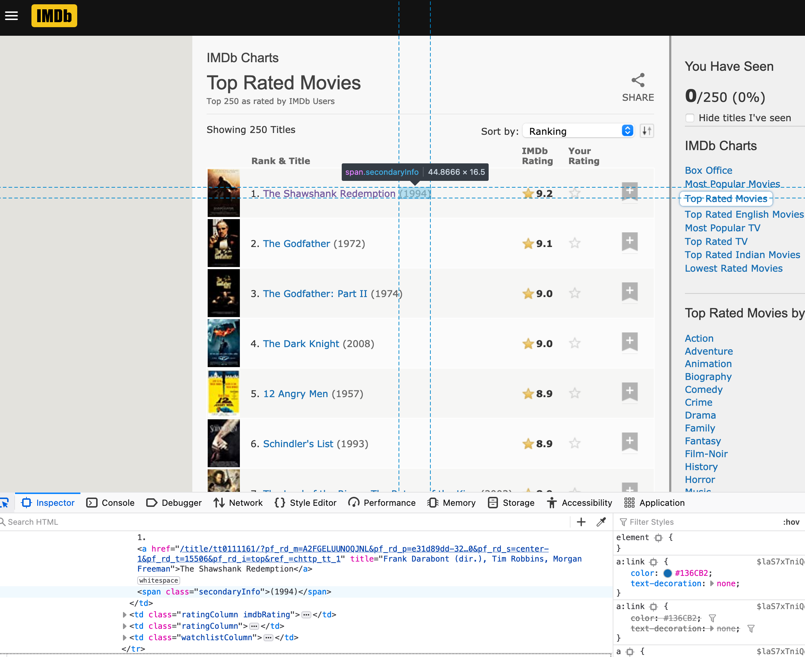
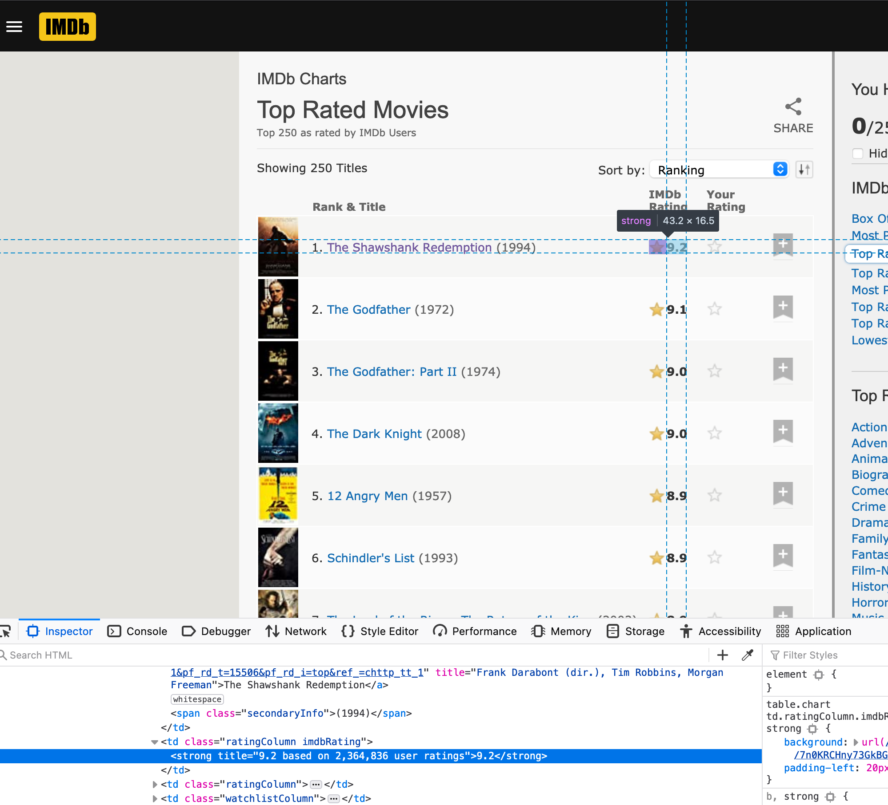
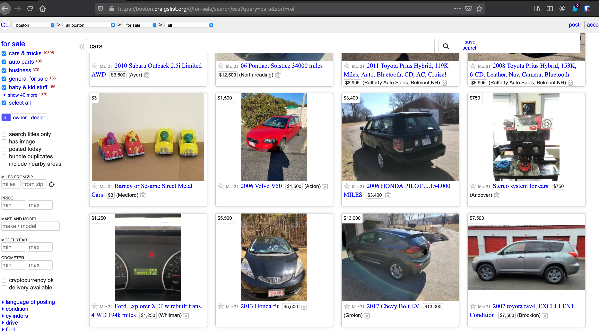
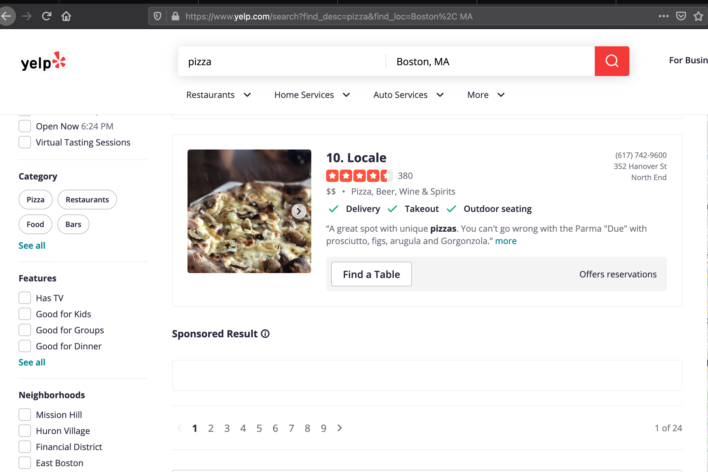
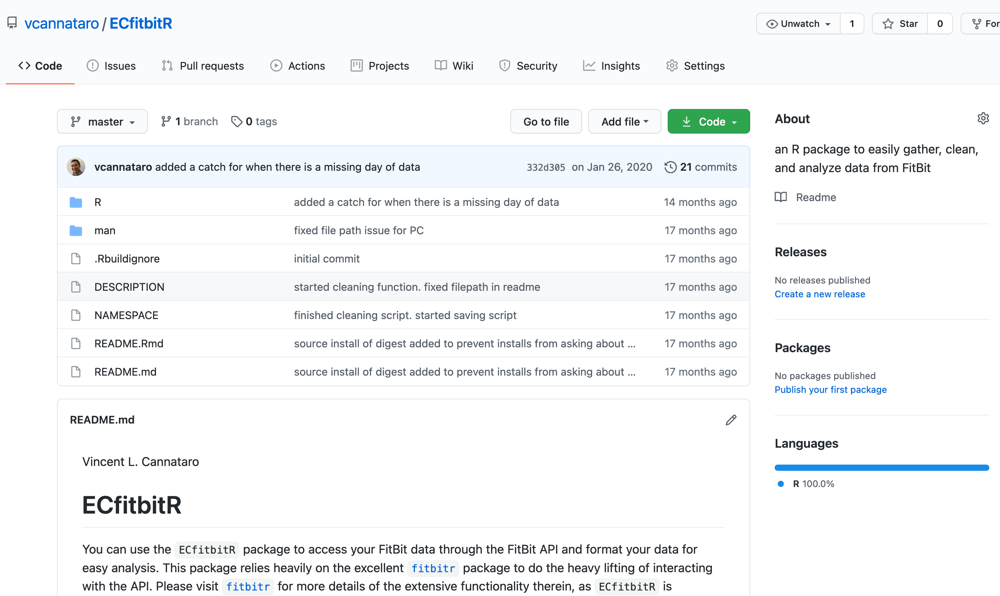

```{r child = "../setup.Rmd"}
```

```{r packages, echo = FALSE, message=FALSE, warning=FALSE}
library(tidyverse)
library(rvest)
library(DT)
```

class: middle

# Scraping the web

---

## Scraping the web: what? why?

- Increasing amount of data is available on the web
--

- These data are provided in an unstructured format: you can always copy&paste, but it's time-consuming and prone to errors

--
- Web scraping is the process of extracting this information automatically and transform it into a structured dataset

--
- Two different scenarios:
    - Screen scraping: extract data from source code of website, with html parser (easy) or regular expression matching (less easy).
    - Web APIs (application programming interface): website offers a set of structured http requests that return JSON or XML files.

---

class: middle

# Web Scraping with rvest

---

## Hypertext Markup Language

- Most of the data on the web is still largely available as HTML 
- It is structured (hierarchical / tree based), but it''s often not available in a form useful for analysis (flat / tidy).

```html
<html>
  <head>
    <title>This is a title</title>
  </head>
  <body>
    <p align="center">Hello world!</p>
  </body>
</html>
```

---

## rvest

.pull-left[
- The **rvest** package makes basic processing and manipulation of HTML data straight forward
- It's designed to work with pipelines built with `%>%`
]
.pull-right[
```{r echo=FALSE,out.width=230,fig.align="right"}
knitr::include_graphics("img/rvest.png")
```
]

---

## Core rvest functions

- `read_html`   - Read HTML data from a url or character string
- `html_node `  - Select a specified node from HTML document
- `html_nodes`  - Select specified nodes from HTML document
- `html_table`  - Parse an HTML table into a data frame
- `html_text`   - Extract tag pairs' content
- `html_name`   - Extract tags' names
- `html_attrs`  - Extract all of each tag's attributes
- `html_attr`   - Extract tags' attribute value by name

---

## SelectorGadget is a useful tool for finding html nodes

.pull-left-narrow[
- Open source tool that eases CSS selector generation and discovery
- Easiest to use with the [Chrome Extension](https://chrome.google.com/webstore/detail/selectorgadget/mhjhnkcfbdhnjickkkdbjoemdmbfginb) 
- Find out more on the [SelectorGadget vignette](https://cran.r-project.org/web/packages/rvest/vignettes/selectorgadget.html)
]
.pull-right-wide[
```{r echo=FALSE, out.width="75%"}
knitr::include_graphics("img/selector-gadget/selector-gadget.png")
```
]

---

## Using the SelectorGadget

```{r echo=FALSE, out.width="80%"}
knitr::include_graphics("img/selector-gadget/selector-gadget.gif")
```

---

```{r echo=FALSE, out.width="95%"}

```

---

```{r echo=FALSE, out.width="95%"}
knitr::include_graphics("img/selector-gadget/selector-gadget-2.png")
```

---

```{r echo=FALSE, out.width="95%"}

```

---

```{r echo=FALSE, out.width="95%"}

```

---

```{r echo=FALSE, out.width="95%"}
knitr::include_graphics("img/selector-gadget/selector-gadget-5.png")
```

---

## Using the SelectorGadget

Through this process of selection and rejection, SelectorGadget helps you come up with the appropriate CSS selector for your needs

```{r echo=FALSE, out.width="65%"}
knitr::include_graphics("img/selector-gadget/selector-gadget.gif")
```

---

## Using Firefox's Web Developer functionality

Click on Tools $\rightarrow$  Web Developer $\rightarrow$ Inspector

```{r echo=F, out.width="65%"}

```


---

## Using Firefox's Web Developer functionality


```{r echo=F, out.width="85%"}
knitr::include_graphics("img/Firefox_inspect.png")
```

---


class: middle

# An example: The top 250 movies on IMDB

---

## Top 250 movies on IMDB

Take a look at the source code, look for the tag `table` tag:
<br>
http://www.imdb.com/chart/top

.pull-left[
```{r echo=FALSE, out.width="100%"}
knitr::include_graphics("img/imdb-top-250.png")
```
]
.pull-right[
```{r echo=FALSE, out.width="94%"}
knitr::include_graphics("img/imdb-top-250-source.png")
```
]


---

## First check if you're allowed!

```{r warning=FALSE}
library(robotstxt)
paths_allowed("http://www.imdb.com")

paths_allowed("http://www.mlb.com")
```

vs. e.g.

```{r warning=FALSE}
paths_allowed("http://www.facebook.com")
```

---

## Plan

```{r echo=FALSE, out.width="90%"}
knitr::include_graphics("img/plan.png")
```

---

## Plan

1. Read the whole page

2. Scrape movie titles and save as `titles` 

3. Scrape years movies were made in and save as `years`

4. Scrape IMDB ratings and save as `ratings`

5. Create a data frame called `imdb_top_250` with variables `title`, `year`, and `rating`

---

class: middle

# Step 1. Read the whole page

---

## Read the whole page

```{r}
page <- read_html("https://www.imdb.com/chart/top/")
page
```

---

## A webpage in R

- Result is a list with 2 elements

```{r}
typeof(page)
```

--

- that we need to convert to something more familiar, like a data frame....

```{r}
class(page)
```

---

class: middle

# Step 2. Scrape movie titles and save as `titles` 

---

## Scrape movie titles

```{r echo=FALSE, out.width="70%"}
knitr::include_graphics("img/titles.png")
```

---

## Scrape the nodes

.pull-left[
```{r echo=FALSE, out.width="100%"}
knitr::include_graphics("img/titles.png")
```
]

.pull-right[
```{r output.lines=17}
page %>%
  html_nodes(".titleColumn a")
```
]


---

## Extract the text from the nodes

.pull-left[
```{r output.lines=16}
page %>%
  html_nodes(".titleColumn a") %>%
  html_text()
```
]
.pull-right[
```{r echo=FALSE, out.width="100%"}
knitr::include_graphics("img/titles.png")
```
]

---

## Save as `titles`

.pull-left[
```{r output.lines=14}
titles <- page %>%
  html_nodes(".titleColumn a") %>%
  html_text()

titles
```
]
.pull-right[
```{r echo=FALSE, out.width="100%"}
knitr::include_graphics("img/titles.png")
```
]

---

class: middle

# Step 3. Scrape year movies were made and save as `years`

---

## Scrape years movies were made in

```{r echo=FALSE, out.width="70%"}

```

---

## Scrape the nodes

.pull-left[
```{r output.lines=17}
page %>%
  html_nodes(".secondaryInfo")
```
]
.pull-right[
```{r echo=FALSE, out.width="100%"}

```
]

---

## Extract the text from the nodes

.pull-left[
```{r output.lines=16}
page %>%
  html_nodes(".secondaryInfo") %>%
  html_text()
```
]
.pull-right[
```{r echo=FALSE, out.width="100%"}

```
]

---

## Clean up the text

We need to go from `"(1994)"` to `1994`:

- Remove `(` and `)`: string manipulation

- Convert to numeric: `as.numeric()`

---

## stringr

.pull-left-wide[
- **stringr** provides a cohesive set of functions designed to make working with strings as easy as possible
- Functions in stringr start with `str_*()`, e.g.
  - `str_remove()` to remove a pattern from a string
  ```{r}
   str_remove(string = "jello", pattern = "el")
  ```
  - `str_replace()` to replace a pattern with another
  ```{r}
  str_replace(string = "jello", pattern = "j", replacement = "h")
  ```
]
.pull-right-narrow[
```{r echo=FALSE, fig.align="left", out.width="100%"}
knitr::include_graphics("img/stringr.png")
```
]

---

## Clean up the text

```{r output.lines=15}
page %>%
  html_nodes(".secondaryInfo") %>%
  html_text() %>%
  str_remove("\\(") # remove (
```

---

## Clean up the text

```{r output.lines=14}
page %>%
  html_nodes(".secondaryInfo") %>%
  html_text() %>%
  str_remove("\\(") %>% # remove (
  str_remove("\\)") # remove )
```

---

## Convert to numeric

```{r output.lines=13}
page %>%
  html_nodes(".secondaryInfo") %>%
  html_text() %>%
  str_remove("\\(") %>% # remove (
  str_remove("\\)") %>% # remove )
  as.numeric()
```

---

## Save as `years`

.pull-left[
```{r output.lines=11}
years <- page %>%
  html_nodes(".secondaryInfo") %>%
  html_text() %>%
  str_remove("\\(") %>% # remove (
  str_remove("\\)") %>% # remove )
  as.numeric()

years
```
]
.pull-right[
```{r echo=FALSE, out.width="100%"}

```
]

---

class: middle

# Step 4. Scrape IMDB ratings and save as `ratings`

---

## Scrape IMDB ratings

```{r echo=FALSE, out.width="55%"}

```

---

## Scrape the nodes

.pull-left[
```{r output.lines=17}
page %>%
  html_nodes("strong")
```
]
.pull-right[
```{r echo=FALSE, out.width="100%"}

```
]

---

## Extract the text from the nodes

.pull-left[
```{r output.lines=16}
page %>%
  html_nodes("strong") %>%
  html_text()
```
]
.pull-right[
```{r echo=FALSE, out.width="100%"}

```
]

---

## Convert to numeric

.pull-left[
```{r output.lines=15}
page %>%
  html_nodes("strong") %>%
  html_text() %>%
  as.numeric()
```
]
.pull-right[
```{r echo=FALSE, out.width="100%"}

```
]

---

## Save as `ratings`

.pull-left[
```{r output.lines=12}
ratings <- page %>%
  html_nodes("strong") %>%
  html_text() %>%
  as.numeric()

ratings
```
]
.pull-right[
```{r echo=FALSE, out.width="100%"}

```
]

---

class: middle

# Step 5. Create a data frame called `imdb_top_250`

---

## Create a data frame: `imdb_top_250`

```{r}
imdb_top_250 <- tibble(
  title = titles, 
  year = years, 
  rating = ratings
  )

imdb_top_250
```

---

```{r echo=FALSE}
dt_imdb <- imdb_top_250 %>% datatable()
widgetframe::frameWidget(dt_imdb)
```

---

## Clean up / enhance

May or may not be a lot of work depending on how messy the data are

- See if you like what you got:

```{r}
glimpse(imdb_top_250)
```

- Add a variable for rank
```{r}
imdb_top_250 <- imdb_top_250 %>%
  mutate(rank = 1:nrow(imdb_top_250)) %>%
  relocate(rank)
```

---

```{r echo=FALSE}
imdb_top_250 %>%
  print(n = 20)
```

---

class: middle

# What next?

---

.question[
Which years have the most movies on the list?
]

--

```{r}
imdb_top_250 %>% 
  count(year, sort = TRUE)
```

---

.question[
Which 1995 movies made the list?
]

--

```{r}
imdb_top_250 %>% 
  filter(year == 1995) %>%
  print(n = 8)
```

---

.question[
Visualize the average yearly rating for movies that made it on the top 250 list over time.
]

--

.panelset[
.panel[.panel-name[Plot]
```{r ref.label = "yearly-avg", echo = FALSE, out.width = "58%"}
```
]
.panel[.panel-name[Code]

```{r yearly-avg, fig.show = "hide"}
imdb_top_250 %>% 
  group_by(year) %>%
  summarise(avg_score = mean(rating)) %>%
  ggplot(aes(y = avg_score, x = year)) +
  geom_point() +
  geom_smooth(method = "lm", se = FALSE) +
  labs(x = "Year", y = "Average score")
```
]
]

---


class: middle

# Web scraping ethics

---

## "Can you?" vs "Should you?"

```{r echo=FALSE, out.width="60%"}
knitr::include_graphics("img/ok-cupid-1.png")
```

.footnote[.small[
Source: Brian Resnick, [Researchers just released profile data on 70,000 OkCupid users without permission](https://www.vox.com/2016/5/12/11666116/70000-okcupid-users-data-release), Vox.
]]

---

## "Can you?" vs "Should you?"

```{r echo=FALSE, out.width="70%"}
knitr::include_graphics("img/ok-cupid-2.png")
```

---

class: middle

# Challenges

---

## Unreliable formatting at the source

```{r echo=FALSE, out.width="90%"}

```

---

## Data broken into many pages

```{r echo=FALSE, out.width="70%"}

```

---

class: middle

# Workflow

---

## Screen scraping vs. APIs

Two different scenarios for web scraping:

- Screen scraping: extract data from source code of website, with html parser (easy) or regular expression matching (less easy)

- Web APIs (application programming interface): website offers a set of structured http requests that return JSON or XML files


---

## A word to the wise

Before trying to scrape your own web data, search for existing `R` packages! 

--
```{r, echo=F, out.width="80%"}

```


---

## A new R workflow

- When working in an R Markdown document, your analysis is re-run each time you knit

- If web scraping in an R Markdown document, you'd be re-scraping the data each time you knit, which is undesirable (and not *nice*)!

- An alternative workflow: 
  - Use an R script to save your code 
  - Saving interim data scraped using the code in the script as CSV or RDS files
  - Use the saved data in your analysis in your R Markdown document


---

# Attributions

Some of the material in this slide deck was inspired by and/or partially adapted from several open-source data science resources, including

- The [datasciencebox](https://github.com/rstudio-education/datascience-box) by Mine Çetinkaya-Rundel [CC BY-SA 4.0](https://creativecommons.org/licenses/by-sa/4.0/) 
- The [R for Data Science](https://r4ds.had.co.nz/) textbook by Hadley Wickham & Garrett Grolemund [CC BY-NC-ND 3.0 US](https://creativecommons.org/licenses/by-nc-nd/3.0/us/) 
- Artwork by @allison_horst [CC BY-SA 4.1](https://creativecommons.org/licenses/by-sa/4.0/) 

